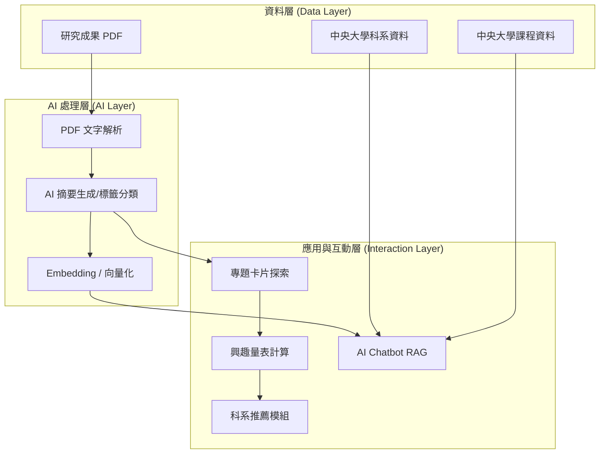
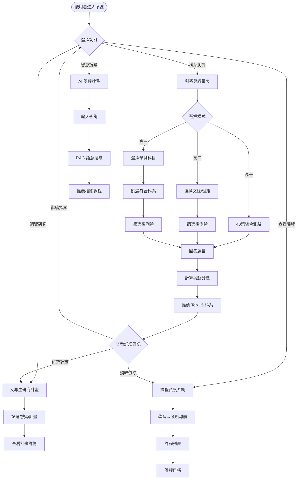
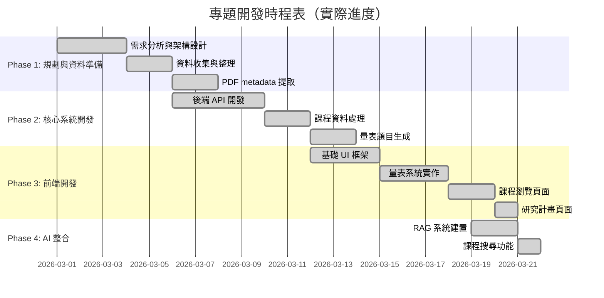
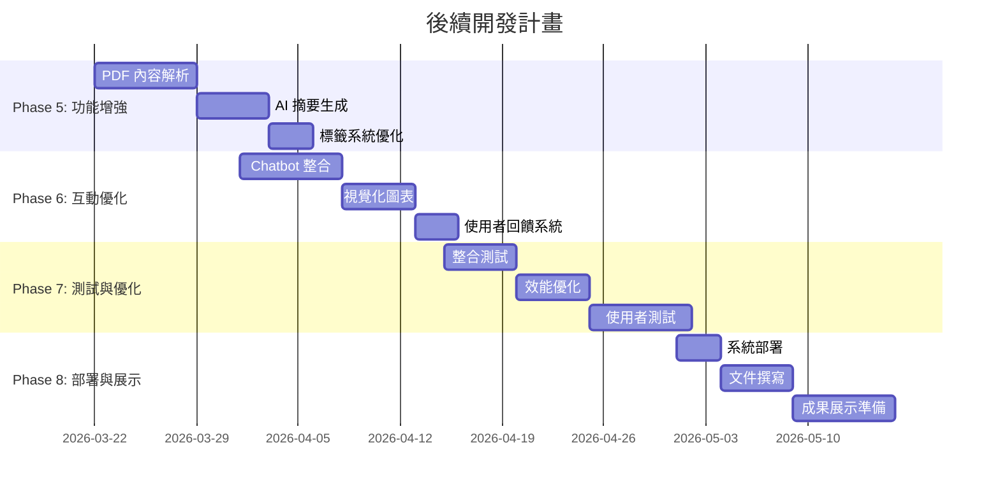

# AI 科系探索系統企劃書

> **基於大專生研究成果的人工智慧科系探索平台**

[TOC]

## 一、執行摘要

本企劃提出一套 **AI 驅動的科系探索系統**，旨在幫助高中生透過大專生研究成果專題來了解不同學術領域。

* **自動化分析：** 解析大專生研究成果報告 PDF，利用 AI 生成簡化摘要並轉換為互動式專題卡片。
* **個人化推薦：** 透過使用者選擇感興趣的專題，建立個人化興趣量表，推薦適合的**中央大學**科系。
* **深層諮詢：** 提供 AI Chatbot 進行科系與課程諮詢，協助學生深入了解未來學習方向。

---

## 二、背景與動機

1. **資訊不對稱：** 高中生選系時常面臨資訊不足或難以理解學術術語的問題。
2. **內容過於教條：** 現有科系官網多偏向行政資訊，缺乏具體、生動的研究案例。
3. **大專生研究價值：** 大專生研究計畫包含豐富的實際案例，能具體呈現領域內容，但其專業度對高中生而言門檻過高。

---

## 三、問題分析

| 現狀問題 | 系統解決方案 |
| --- | --- |
| 資訊分散於各系網，難以橫向比較 | 整合於單一平台，提供統一格式的專題卡片 |
| 研究報告專業度高，閱讀門檻高 | 利用 LLM 生成「高中生友善版」摘要 |
| 傳統量表過於抽象，缺乏實證 | 以「實際研究案例」作為興趣觸發點 |
| 缺乏互動式引導 | 導入 RAG 架構的 AI Chatbot 即時問答 |

---

## 四、專題目標

### 主要目標

1. **降低資訊門檻**
   - 將專業的大專生研究報告轉化為高中生易懂的內容
   - 透過實際研究案例具體呈現各科系的學習內容

2. **提供個人化探索體驗**
   - 根據不同學習階段（高一、高二、高三）提供適配的量表
   - 透過興趣量表精準推薦適合的科系

3. **整合完整資訊**
   - 統整中央大學所有科系的研究成果、課程資訊
   - 提供一站式的科系探索平台

4. **智慧化輔助決策**
   - 結合學測採計科目，協助高三生做出實際可行的選擇
   - 透過 AI 課程搜尋，快速找到感興趣的課程領域

### 量化目標

- 整合 **114 學年度 3,316 門課程**資料
- 涵蓋中央大學 **9 個學院、40+ 個系所**
- 收錄 **104-114 學年度（11 年）大專生研究計畫**
- 提供 **3 種模式**的科系興趣量表（高一、高二、高三）

---

## 五、系統架構



---

## 六、系統流程

### 整體流程圖



### 詳細流程說明

#### 1. 資料準備階段（離線處理）

**已完成：**
- ✅ PDF 檔案掃描與 metadata 提取
- ✅ 研究計畫資料整理（459 筆）
- ✅ 課程資料處理與學期資訊生成（3,316 筆）
- ✅ 真實研究題目提取與量表題目生成（189 題）
- ✅ 學測篩選標準整合（ncu_caac.csv）

**資料流：**
```
各系大專生計畫(104-114)/*.pdf
  → metadata 提取
  → projects_metadata.json

data_ncu_course/114_1/*.json + 114_2/*.json
  → 合併處理
  → processed_courses.json

projects_metadata.json
  → 真實題目提取
  → assessment_questions.json
```

#### 2. 科系測評流程

**步驟：**
1. **選擇模式**
   - 高一模式：直接進入測驗
   - 高二模式：先選擇文組/理組 → 篩選題目
   - 高三模式：先選擇學測科目 → 篩選符合科系 → 篩選題目

2. **作答流程**
   - 依序回答題目（每題 1-5 分）
   - 顯示進度（第 X/總數 題，涵蓋 N 個科系）
   - 可跳過題目

3. **結果計算**
   - 統計各科系興趣分數
   - 統計各標籤興趣分數
   - 排序推薦 Top 15 科系

4. **結果呈現**
   - 高一：顯示推薦科系 + 文組/理組判定
   - 高二：顯示推薦科系
   - 高三：顯示可申請的推薦科系
   - 展示 Top 3 卡片 + 完整列表
   - 興趣標籤分析

#### 3. 研究計畫瀏覽流程

**步驟：**
1. 進入「大專生研究計畫」頁面
2. 查看統計儀表板（總數、學年度分布、類型分布）
3. 使用篩選器：
   - 科系篩選（下拉選單）
   - 學年度篩選（104-114）
   - 關鍵字搜尋
4. 瀏覽計畫卡片（網格展示）
5. 點擊查看詳細資訊
6. 下載 PDF（如有連結）

#### 4. 課程資訊瀏覽流程

**步驟：**
1. 進入「課程資訊」頁面
2. **左側導航：**
   - 第一層：點擊學院（9 個選項，彩色漸層圖示）
   - 第二層：點擊系所（該學院下的所有系所）
3. **右側顯示：**
   - 該系所的所有課程表格
   - 課程資訊：名稱、類型、學分、學期、教師
   - 點擊展開查看課程目標
4. **篩選功能：**
   - 關鍵字搜尋（課程名稱、教師）
   - 必修/選修篩選

#### 5. AI 課程搜尋流程

**步驟：**
1. 進入「課程搜尋」頁面
2. 輸入自然語言查詢
   - 範例："我想學人工智慧"
   - 範例："有關文學創作的選修課"
3. 系統進行 RAG 語意搜尋：
   - 查詢向量化
   - 在 Qdrant 中搜尋相似課程
   - LLM 整合結果
4. 顯示推薦課程列表
5. 查看課程詳細資訊

### 使用者旅程範例

**案例：高三學生探索科系**

1. **測評階段**
   - 選擇「高三模式」
   - 勾選學測科目：國文、英文、數A、自然
   - 系統篩選出符合科系（如：理學院、工學院相關科系）
   - 完成 50 題測驗
   - 獲得推薦：物理系、資工系、數學系...

2. **深入了解**
   - 點擊「物理系」查看詳細資訊
   - 切換到「大專生研究計畫」
   - 篩選「物理學系」
   - 瀏覽物理系學生的研究題目
   - 發現感興趣的量子物理研究

3. **課程探索**
   - 進入「課程資訊」
   - 點擊「理學院」→「物理學系」
   - 查看物理系的必修和選修課程
   - 了解學期安排

4. **AI 輔助搜尋**
   - 使用「課程搜尋」
   - 輸入："量子物理相關的課程"
   - 獲得跨系所的相關課程推薦

---

## 七、核心功能說明


### 1. 科系興趣量表

**✅ 已實作完成**

分成三種模式，根據學生階段提供適配的量表：

#### 高一模式：文組與理組（粗略分組）
- **目的：** 協助高一生進行文理分組
- **題目數量：** 40 題（涵蓋文組與理組科系）
- **結果呈現：**
  - 推薦前 15 個科系
  - 明確標示適合「文組」或「理組」
  - 顯示 Top 3 科系卡片 + 完整列表
  - 興趣標籤分數分析

#### 高二模式：細分科系（科系探索）
- **目的：** 在已選定文理組的基礎上，探索具體科系
- **特色：**
  - 開始前選擇「文組模式」或「理組模式」
  - 只顯示該組別的科系題目，大幅減少題目數量
  - 更聚焦於該組別的科系特色
- **題目來源：** 使用各系大專生研究計畫的真實題目
- **題目數量：** 約 99 題（依文理組篩選後約 40-60 題）

#### 高三模式：結合學測科目（實際科系選擇）
- **目的：** 根據學測選考科目，推薦實際可申請的科系
- **流程：**
  1. 選擇學測報考科目（國、英、數A、數B、社、自）
  2. 系統篩選出「採計這些科目」的科系
  3. 只針對符合條件的科系出題
- **資料來源：** 整合 `ncu_caac.csv` 學測篩選標準
- **特色：**
  - 避免推薦「無法報考」的科系
  - 提高推薦的實用性
  - 題目數量約 50 題（依選考科目而定）

**技術實作：**
- 前端：動態題目載入、即時計分、進度追蹤
- 後端：題目篩選邏輯、興趣分數計算、科系推薦演算法
- 資料：`assessment_questions.json`（189 題，含真實研究題目）


### 2. 大專生研究計畫整合

**✅ 已實作完成**

#### 資料收集
- **範圍：** 中央大學 104-114 學年度（11 年）大專生研究計畫
- **類型：** E（個人）、H（雙人）、M（多人）、B（跨領域）
- **資料結構：**
  ```
  各系大專生計畫(104-114)/
  ├─ 中國文學系/
  │  ├─ 104E207_余澤承_論山海經奇幻空間.pdf
  │  └─ ...
  ├─ 資訊工程學系/
  └─ ...
  ```

#### 資料處理流程
1. **PDF 解析：** 使用 Python 腳本掃描所有 PDF 檔案
2. **Metadata 提取：** 從檔名解析出：
   - 學年度
   - 計畫類型
   - 學生姓名
   - 研究題目
3. **科系歸類：** 根據資料夾結構自動分類
4. **資料儲存：** `projects_metadata.json`（459 筆研究計畫）

#### 題目生成
- **來源：** 使用真實的研究計畫標題作為量表題目
- **腳本：** `generate_real_questions.py`
- **策略：**
  - 每個科系隨機選擇 1-3 個代表性研究計畫
  - 確保每個科系至少有一個題目
  - 根據科系特性配對適當的興趣標籤
- **成果：** 189 題涵蓋 43 個科系的真實研究題目

**未來優化方向：**
- 使用 `PyMuPDF` 進行「智慧型分段」，提取 PDF 內文
- 利用 LLM 生成：
  - 研究動機與問題（前段）
  - 研究方法（中段）
  - 研究結果（後段）
- 自動標籤分類系統

### 3. 大專生計畫瀏覽系統

**✅ 已實作完成**

提供完整的研究計畫瀏覽功能：

#### 功能特色
- **統計儀表板：**
  - 總計畫數量
  - 學年度分布
  - 計畫類型分布
  - 科系分布
- **多維度篩選：**
  - 依科系篩選
  - 依學年度篩選（104-114）
  - 關鍵字搜尋（計畫標題、學生姓名）
- **詳細資訊：**
  - 計畫標題
  - 學生姓名
  - 學年度與類型
  - 所屬科系
  - PDF 連結（如有）

#### 資料呈現
- 網格式卡片展示
- 每張卡片顯示計畫核心資訊
- 支援點擊查看詳細內容
- 響應式設計，適配各種螢幕

### 4. 課程資訊系統

**✅ 已實作完成**

整合中央大學 114 學年度完整課程資料：

#### 資料規模
- **總課程數：** 3,316 門
- **涵蓋範圍：**
  - 9 個學院
  - 40+ 個系所
  - 上學期、下學期、全年課程

#### 瀏覽方式
- **左側導航：**
  - 第一層：學院列表（9個學院，彩色漸層圖示）
  - 第二層：系所列表（該學院下的所有系所）
- **右側內容：**
  - 課程表格（課程名稱、類型、學分、學期、教師）
  - 可展開查看課程目標

#### 篩選功能
- 關鍵字搜尋（課程名稱、教師、系所）
- 必修/選修篩選
- 學期資訊顯示（上學期/下學期/全年）

#### 視覺設計
- 每個學院配有專屬彩色漸層圖示
- 專業的 React Icons
- 清晰的層級結構

### 5. AI 課程搜尋 (RAG)

**✅ 已實作完成**

使用 RAG（Retrieval-Augmented Generation）技術提供智慧課程搜尋：

#### 技術架構
- **向量資料庫：** Qdrant
- **Embedding 模型：** 將課程資訊向量化
- **LLM 整合：** Claude/GPT 進行語意理解

#### 功能特色
- **自然語言查詢：**
  - "我想學人工智慧相關的課程"
  - "有沒有跟文學創作有關的選修？"
- **語意搜尋：** 理解使用者意圖，不只是關鍵字比對
- **精準推薦：** 根據課程內容、目標、關鍵字進行匹配

**未來擴展：**
- 整合科系特色資訊
- 提供互動式 Chatbot 問答
- 個人化學習路徑建議

---

## 八、技術架構

### 前端開發

* **框架：** React 18 + TypeScript + Vite
* **UI 框架：** Tailwind CSS
* **圖示庫：** React Icons (Hero Icons)
* **HTTP 客戶端：** Axios
* **路由：** React Router v6
* **狀態管理：** React Hooks (useState, useEffect, useMemo)

### 後端開發

* **API 框架：** FastAPI (Python)
* **資料驗證：** Pydantic
* **CORS 處理：** FastAPI CORS Middleware
* **靜態檔案：** 提供 PDF 檔案存取

### AI 與資料處理

* **語言模型：** Claude (Anthropic) / GPT-4
* **向量資料庫：** Qdrant
* **PDF 解析：** PyMuPDF (計畫中)
* **Embedding：** OpenAI Embeddings / Claude Embeddings
* **檢索架構：** 自建 RAG pipeline

### 資料儲存

* **課程資料：** JSON 格式 (`processed_courses.json`, 3316 筆)
* **研究計畫：** JSON 格式 (`projects_metadata.json`, 459 筆)
* **量表題目：** JSON 格式 (`assessment_questions.json`, 189 題)
* **學測標準：** CSV 格式 (`ncu_caac.csv`)

### 開發工具

* **版本控制：** Git
* **套件管理：** npm (前端) + pip (後端)
* **開發模式：** Hot reload (Vite + Uvicorn)

---

## 九、開發時程

### 已完成階段（2026/03/01 - 2026/03/21）



### 下一階段規劃（2026/03/22 onwards）



---

## 十、當前成果與未來發展

### 已完成功能（v1.0）

#### 核心功能
✅ **科系興趣量表系統**
- 三種模式（高一、高二、高三）完整實作
- 189 題真實研究題目
- 智慧推薦演算法（Top 15 科系）
- 文理分組判定
- 興趣標籤分析

✅ **大專生研究計畫系統**
- 459 筆研究計畫資料整合
- 104-114 學年度完整資料
- 多維度篩選（科系、學年度、關鍵字）
- 統計儀表板

✅ **課程資訊系統**
- 3,316 門課程完整資料
- 9 個學院、40+ 系所
- 左右分欄導航設計
- 彩色漸層學院圖示
- 學期資訊顯示（上學期/下學期/全年）
- 必修/選修篩選

✅ **AI 課程搜尋**
- RAG 技術整合
- 語意化搜尋
- 向量資料庫（Qdrant）

#### 技術成果
- 前後端分離架構
- RESTful API 設計
- 響應式 UI 設計
- 資料自動化處理腳本

### 未來發展方向

#### 短期優化（1-3個月）

1. **PDF 內容分析**
   - 使用 PyMuPDF 提取研究報告內文
   - LLM 生成高中生友善版摘要
   - 自動標籤分類系統

2. **Chatbot 整合**
   - 互動式科系諮詢
   - 課程推薦對話
   - 學習路徑建議

3. **視覺化增強**
   - 興趣雷達圖
   - 科系適配度圖表
   - 學習路徑圖

#### 中期擴展（3-6個月）

1. **個人化功能**
   - 使用者帳號系統
   - 儲存測驗結果
   - 追蹤探索歷程

2. **社群功能**
   - 學長姐經驗分享
   - 科系 Q&A 論壇
   - 研究計畫評論

3. **資料擴充**
   - 系所特色介紹
   - 畢業出路統計
   - 產學合作案例

#### 長期願景（6個月以上）

1. **橫向擴展**
   - 支援全台大專院校資料
   - 跨校科系比較
   - 多校推薦系統

2. **縱向延伸**
   - 整合 104 職涯資料
   - 建立「研究 → 科系 → 職涯」完整路徑
   - 業界導師配對

3. **AI 增強**
   - 個人化學習路徑生成
   - 智慧選課建議
   - 研究興趣媒合

### 技術債與改進方向

1. **效能優化**
   - 課程資料分頁載入
   - 圖片延遲載入
   - API 快取機制

2. **程式碼品質**
   - 單元測試覆蓋
   - 型別安全加強
   - 錯誤處理完善

3. **使用者體驗**
   - 無障礙設計
   - 多語言支援
   - 行動版優化

---

**中央大學專題項目 - 2026**

