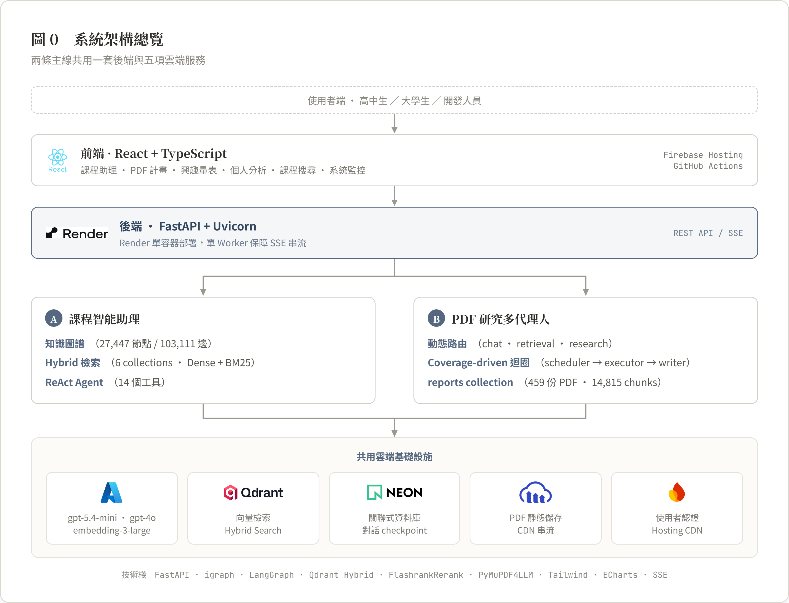

# NCU Course Advisor

國立中央大學「選課助理暨大專研究計畫」AI 平台。以知識圖譜、多信號檢索與多代理人 RAG，
服務高中生的科系探索與大學生的選課規劃。

> 想看更完整的系統設計與技術細節，請見 **[docs/final-report.md](docs/final-report.md)**（架構、
> 資料規模、各功能實作細節、資料庫 Schema）；部署與環境設定請見
> **[docs/deployment.md](docs/deployment.md)**。

---

## 動機

本專案要解決兩個交織的問題：**選課資訊零散**，以及**高中生無法具體理解「科系在做什麼研究」**。

### 問題一：選課資訊零散

大學選課存在嚴重的**資訊零散**問題。以中央大學為例，課程資訊分散於課務系統、教務處應修
科目表、課務資訊網學分學程、Collego 科系介紹等多個來源；修課資格（先修、限修、開放對象與
排除條件）以自然語言散落在各課程說明裡。傳統關鍵字搜尋難以處理這類問題：使用者的用詞（如
「深度學習」）常與資料中的用詞（如「神經網路」）不一致；「哪些系所有教某個技術」需要跨越
「技術—課程—系所」的多跳關係；「我這個學院的學生可以修哪些課」則需要理解複雜的修課資格
規則。單純的向量檢索雖能處理語意相似，卻無法精確處理結構化關係與資格過濾。

### 問題二：科系探索缺乏具體感

高中生選填科系時，最常見的困境是不知道「這個科系的人實際上在做什麼研究」。招生簡章寫的
多半是抽象的系所簡介；而國科會大專生研究計畫是由真實大學生完成的第一手具體研究題目，內容
卻是寫給學術審查看的正式全文，對高中生來說門檻太高、讀不下去。本專案的 PDF 研究計畫系統
把這些真實計畫轉化成高中生看得懂的摘要，再進一步生成**興趣量表**——高中生不用啃完一篇論文，
只要針對每份計畫的動機、方法、成果回答幾個簡單問題，系統就依科系累加分數，推薦最符合他們
興趣的科系。**興趣量表是本專案最核心的特色**：它把「讀懂一篇研究計畫全文」這個對高中生幾乎
不可能的任務，轉換成「回答幾題有沒有興趣」，讓科系探索不需要先看懂論文。

這正是本專案想解決的問題：**如何整合 LLM、知識圖譜與多種檢索策略，建構一套能同時處理語意
模糊查詢、結構化關係查詢與資格過濾的教育領域 RAG 系統，並讓高中生也能透過真實研究計畫的
摘要與興趣量表，快速理解與定位自己對什麼樣的研究有興趣。**

---

## 設計理念

- **模組化 RAG，而非單一管線。** 系統不是「檢索—拼接—生成」的線性流程，而是把路由、多路
  檢索融合、迭代式檢索、自我修正、長期記憶拆成可組合的模組——依問題複雜度動態決定要用多輕
  或多重的策略，簡單問題不需要跑完整套深度研究迴圈。
- **知識圖譜是檢索索引，不是全域摘要。** 圖譜的角色是支援多跳關係查詢與 Personalized
  PageRank 概念擴散、並把圖信號融合進向量排序（graph-as-index），而不是像 Microsoft
  GraphRAG 那樣預先生成整個語料庫的階層式社群摘要——本系統要精確回答「哪些系所必修某技術」
  這類結構化問題，而非做全域主題歸納。
- **會自己承認不會，而不是硬答。** 每個 agent 完成任務後會自我評估證據是否足夠，不足就
  「逃逸」升級給更強的下一位（chat → retrieval → research），但換手次數有上限，保證不會
  無限循環；證據不足時明確標示，而非產生看似合理實則捏造的答案。
- **設計對象是高中生，不只是大學生。** 修課資格、研究計畫全文對高中生來說門檻太高，因此
  興趣量表用 AI 把真實研究計畫改寫成高中生看得懂的導讀與題目，讓「探索科系興趣」這件事
  不需要先看懂論文。

---

## 核心功能

以下依網站導覽列順序列出每個頁面實際能做什麼：

| 頁面（導覽列） | 路由 | 你可以做什麼 |
|------|------|------|
| **課程助理** | `/course-search` | 用自然語言問選課問題（找課、查修課資格、比較課程、跨技術探索），AI 邊查邊答 |
| **課程資訊** | `/courses` | 依學院／系所瀏覽全校課程，關鍵字或語意搜尋，最多同時比較 3 門課 |
| **系所修課** | `/curriculum` | 查詢各系所畢業規定、必修/選修學分結構，樹狀瀏覽課程規劃 |
| **研究計畫** | `/projects` | 瀏覽歷年國科會大專生研究計畫，開啟 PDF 原文並直接用 AI 問答 |
| **興趣量表** | `/assessment` | 針對研究計畫摘要作答，依高一／高二／高三提供不同分組與科系推薦 |
| **資源連結** | `/resources` | 落點分析、甄選入學等升學資源，以及各學院系所官網目錄 |
| **個人分析**（登入後） | `/profile` | 從自己的對話歷史看探索型態、興趣領域雷達圖 |
| **系統監控**（開發者專用） | `/monitor` | 用量、費用、延遲即時儀表板 |

所有頁面共用同一套雲端基礎設施（Azure OpenAI、Qdrant、Neon PostgreSQL、Firebase）；技術上可
歸為「課程智能助理」與「PDF 研究計畫系統」兩大後端系統，架構細節見下一節。

---

## 系統架構



前端（React + TypeScript）透過 REST API / SSE 呼叫後端（FastAPI，Render 單容器部署）；
後端分成「課程智能助理」與「PDF 研究多代理人」兩條主線，共用 Azure OpenAI、Qdrant、
Neon PostgreSQL、Cloudinary、Firebase 五項雲端服務。知識圖譜規模 27,447 節點 / 103,111 邊，
課程助理暴露 14 個工具給 ReAct Agent；PDF 系統以動態路由（chat / retrieval / research）
分派給對應的代理人。

---

## 技術亮點

### 1. 知識建構管線：從課綱到知識圖譜


四個分工的 LLM Agent（本地 Qwen3-14B）從課綱與教師資料萃取 concept / technology / field /
competency / topic 標籤，成為知識圖譜的節點與加權邊。圖譜支援多跳關聯查詢、共享概念地圖、
Personalized PageRank、概念鄰域 BFS 四類圖演算法查詢。

### 2. 多信號 RRF 檢索


課程搜尋不是單一向量搜尋，而是六個信號（向量語意、課名精確/包含匹配、圖節點鄰居）各自產生
排名，再用 Reciprocal Rank Fusion 統一排序；技術類查詢（如「PyTorch 的課」）則走 Graph-First
捷徑直接命中，不進入六信號流程。

### 3. Research Agent：Coverage-Driven 證據迴圈


PDF 問答的深度研究不是傳統一問一答式 RAG，而是先定義要蒐集的「證據槽」，逐輪檢索補齊，
證據足夠才動筆。LangGraph 實際只有 3 個 node，靠 scheduler 反覆呼叫 slot_executor
（plan → retrieve → reflect）表現得像多階段管線；HyDE 與 cross-slot 路由降低「查不到就漏寫」
的風險。

### 4. Orchestrator 動態路由與逃逸機制


每個 agent（chat / retrieval / research）完成後自我評估能不能勝任，不足就「逃逸」升級給
下一位，最多換手兩次，保證不會無限循環。只有 research agent 有資格把這輪對話寫入長期記憶
（對話摘要 / 語意記憶 / 使用者畫像三層），chat、retrieval 全程只能讀取。

---

## 技術棧

| 類別 | 技術 |
|------|------|
| 前端 | React 18 + TypeScript、Tailwind CSS、ECharts、Firebase Hosting |
| 後端 | FastAPI + Uvicorn（單 Worker，SSE 安全） |
| LLM | Azure OpenAI：`gpt-5.4-mini`（課程助理）、`gpt-4o` / `gpt-4o-mini`（PDF 計畫 Agent / 路由） |
| Embedding | `text-embedding-3-large`（3072 維） |
| 向量資料庫 | Qdrant（Hybrid Dense + BM25，9 個 collection） |
| 知識圖譜 | igraph（Weighted Personalized PageRank，in-memory） |
| Agent 框架 | LangGraph（PDF Research Agent 狀態機） |
| 關聯式資料庫 | PostgreSQL（Neon Serverless） |
| PDF 處理 | PyMuPDF4LLM、Azure Document Intelligence、LlamaParse |
| 認證 | Firebase Authentication / Admin SDK |
| 檔案儲存 | Cloudinary |

---

## 資料來源

以下資料來源同時顯示於網站首頁的頁尾：

| 類型 | 來源 | 連結 |
|------|------|------|
| 課程資訊 | 中央大學選課系統 | <https://cis.ncu.edu.tw/Course/main/query/byYears> |
| 系所修課 | 中央大學教務處 | <https://pdc.adm.ncu.edu.tw/p/426-1019-7.php?Lang=zh-tw> |
| 學分學程 | 中央大學課務資訊網 | <https://course.ncu.edu.tw/p/412-1014-2059.php?Lang=zh-tw> |
| 研究計畫 | 國科會學術補助獎勵查詢 | <https://wsts.nstc.gov.tw/STSWeb/Award/AwardMultiQuery.aspx> |
| 教師資料 | 大專校院校務資訊公開平臺 | <https://udb.moe.edu.tw/> |
| 升學參考 | ColleGo! 大學選才系統 | <https://collego.edu.tw/> |

---

## 快速開始

```bash
# 後端
cd backend
python -m venv venv
venv\Scripts\activate
pip install -r requirements.txt
uvicorn app.main:app --reload   # http://localhost:8000

# 前端（另開一個終端機）
cd frontend
npm install
npm run dev                     # http://localhost:5173
```

完整的環境變數設定、雲端部署流程與資料部署原則，請見 **[docs/deployment.md](docs/deployment.md)**。

---

## 專案結構

```text
project/
├── backend/                     # FastAPI 後端（課程助理 + PDF 多代理人）
├── frontend/                    # React + Vite 前端
├── data/
│   ├── processed/               # 可隨後端部署的小型資料 + 知識圖譜
│   └── raw/                     # 原始課程、招生、研究計畫 PDF 資料
├── scripts/
│   ├── rag/                     # 知識圖譜 / Qdrant 向量索引建置腳本
│   └── storage/                 # Cloudinary 上傳腳本
├── docs/
│   ├── final-report.md          # 期末成果報告
│   └── deployment.md            # 部署與環境設定
├── png/                          # README 用架構圖
└── .github/workflows/           # Firebase Hosting 自動部署
```
