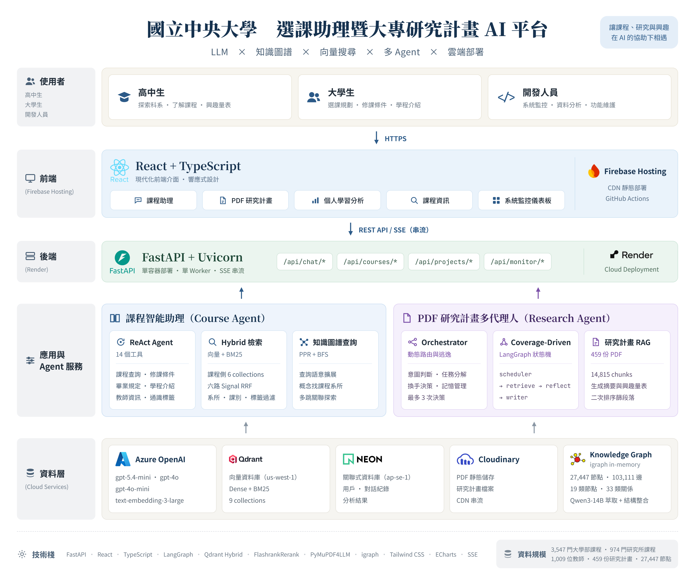
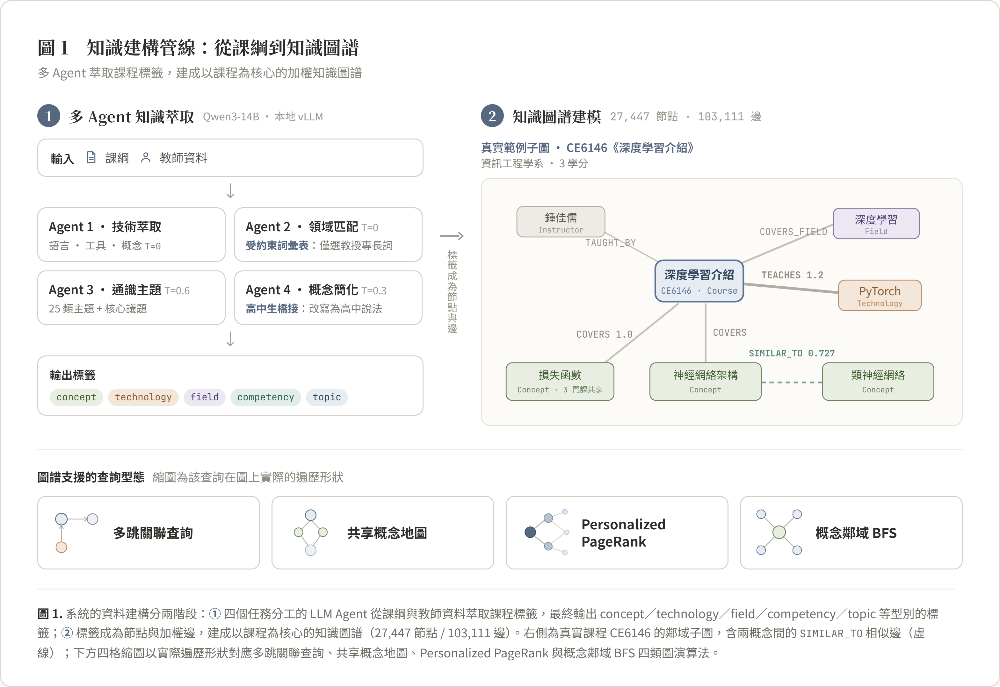
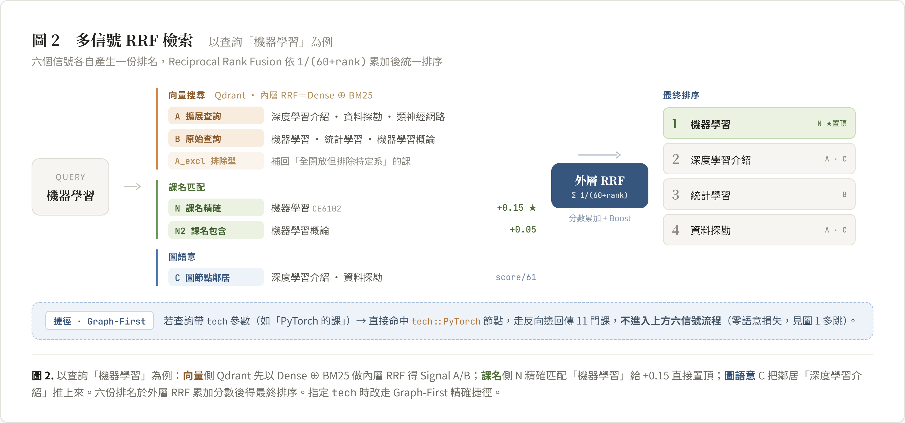
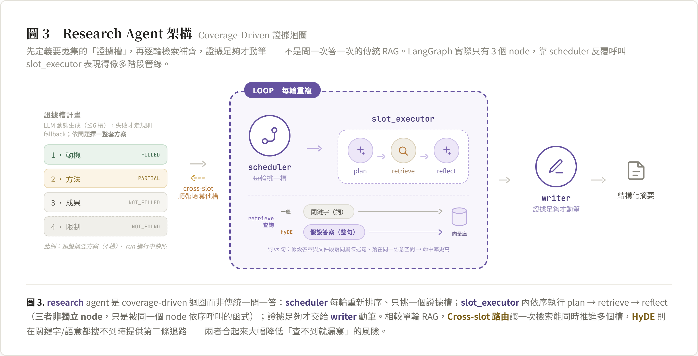
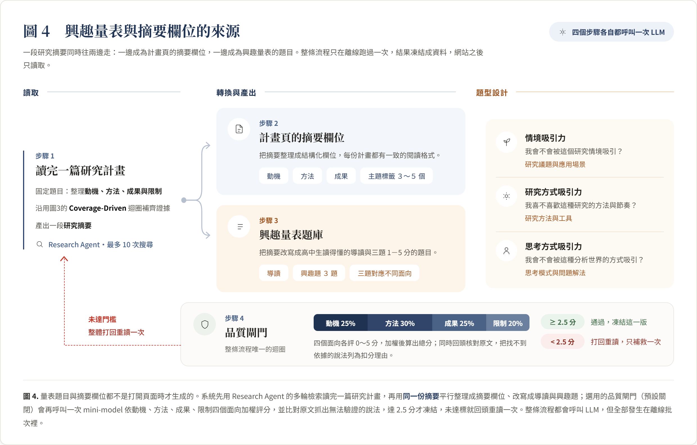
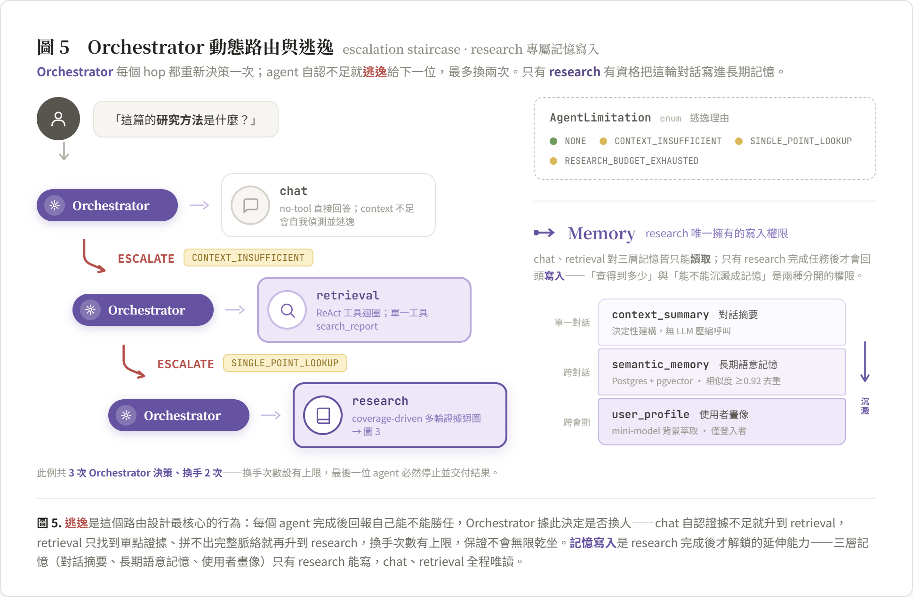

# NCU Course Advisor

國立中央大學「選課助理暨大專研究計畫」AI 平台。以知識圖譜、多信號檢索與多代理人 RAG，
服務高中生的科系探索與大學生的選課規劃。

> 想看更完整的系統設計與技術細節，請見 **[docs/final-report.md](docs/final-report.md)**（架構、
> 資料規模、各功能實作細節、資料庫 Schema）；部署與環境設定請見
> **[docs/deployment.md](docs/deployment.md)**。

---

## 動機

本專案要解決兩個交織的問題：**選課資訊零散**，以及**高中生無法具體理解「科系在做什麼研究」**。

**問題一：選課資訊零散**
- 課程資訊分散在課務系統、教務處應修科目表、課務資訊網學分學程、Collego 科系介紹等多個來源
- 修課資格（先修、限修、開放對象、排除條件）以自然語言散落在各課程說明裡，查不到重點
- 使用者用詞跟資料用詞常不一致（如「深度學習」vs「神經網路」），關鍵字搜尋抓不到
- 「哪些系所有教某個技術」需要跨越「技術—課程—系所」的多跳關係，單純向量搜尋做不到
- 「這個學院的學生可以修哪些課」需要理解複雜的修課資格規則，不是語意相似度能判斷的問題

**問題二：科系探索缺乏具體感**
- 高中生不知道「這個科系的人實際上在做什麼研究」——招生簡章多半只有抽象簡介
- 國科會大專生研究計畫雖是第一手具體題目，但寫給學術審查看，正式全文對高中生門檻太高
- 本專案把真實研究計畫轉化成高中生看得懂的摘要，再生成**興趣量表**：不用啃完一篇論文，
  只要回答幾個簡單問題，系統就依科系累加分數推薦
- **興趣量表是本專案最核心的特色**——把「讀懂一篇研究計畫全文」這個幾乎不可能的任務，
  轉換成「回答幾題有沒有興趣」

這正是本專案想解決的問題：**整合 LLM、知識圖譜與多種檢索策略，建構一套能同時處理語意模糊
查詢、結構化關係查詢與資格過濾的教育領域 RAG 系統，並讓高中生透過真實研究計畫的摘要與
興趣量表，快速理解自己對什麼樣的研究有興趣。**

---

## 設計理念

- **模組化 RAG，而非單一管線。** 系統不是「檢索—拼接—生成」的線性流程，而是把路由、多路
  檢索融合、迭代式檢索、自我修正、長期記憶拆成可組合的模組——依問題複雜度動態決定要用多輕
  或多重的策略，簡單問題不需要跑完整套深度研究迴圈。
- **知識圖譜是檢索索引，不是全域摘要。** 圖譜的角色是支援多跳關係查詢與 Personalized
  PageRank 概念擴散、並把圖信號融合進向量排序（graph-as-index），而不是像 Microsoft
  GraphRAG 那樣預先生成整個語料庫的階層式社群摘要——本系統要精確回答「哪些系所必修某技術」
  這類結構化問題，而非做全域主題歸納。
- **會自己承認不會，而不是硬答。** 每個 agent 完成任務後會自我評估證據是否足夠，不足就
  「逃逸」升級給更強的下一位（chat → retrieval → research），但換手次數有上限，保證不會
  無限循環；證據不足時明確標示，而非產生看似合理實則捏造的答案。
- **設計對象是高中生，不只是大學生。** 修課資格、研究計畫全文對高中生來說門檻太高，因此
  興趣量表用 AI 把真實研究計畫改寫成高中生看得懂的導讀與題目，讓「探索科系興趣」這件事
  不需要先看懂論文。

---

## 核心功能

前端共 8 個頁面，但背後只有兩套 AI 系統在服務：選課相關的問題都交給「課程智能助理」的 ReAct
Agent，直接查 Hybrid 檢索與知識圖譜作答；研究計畫相關的問題交給「PDF 研究計畫多代理人」，先
由 Orchestrator 判斷難度——簡單問題 chat agent 幾秒答完，複雜問題才升級到 research agent 跑
完整的 coverage-driven 檢索迴圈。兩套系統最後都收斂到同一個 FastAPI 服務，共用 Azure OpenAI、
Qdrant、Neon PostgreSQL 三項核心雲端服務。

| 頁面（導覽列） | 路由 | 你可以做什麼 |
|------|------|------|
| **課程助理** | `/course-search` | 用自然語言問選課問題（找課、查修課資格、比較課程、跨技術探索），AI 邊查邊答 |
| **課程資訊** | `/courses` | 依學院／系所瀏覽全校課程，關鍵字或語意搜尋，最多同時比較 3 門課 |
| **系所修課** | `/curriculum` | 查詢各系所畢業規定、必修/選修學分結構，樹狀瀏覽課程規劃 |
| **研究計畫** | `/projects` | 瀏覽歷年國科會大專生研究計畫，開啟 PDF 原文並直接用 AI 問答 |
| **興趣量表** | `/assessment` | 針對研究計畫摘要作答，依高一／高二／高三提供不同分組與科系推薦 |
| **資源連結** | `/resources` | 落點分析、甄選入學等升學資源，以及各學院系所官網目錄 |
| **個人分析**（登入後） | `/profile` | 從自己的對話歷史看探索型態、興趣領域雷達圖 |
| **系統監控**（開發者專用） | `/monitor` | 用量、費用、延遲即時儀表板 |

### 這些頁面實際能幫高中生回答什麼問題

**興趣量表：看出你適合什麼樣的研究，而不是只看科系名字。** 興趣量表不問「你喜歡機械系嗎」，
而是先把真實研究計畫轉成具體情境問題，讓你在不知道背後是哪個科系的情況下，憑直覺選有興趣的
研究動機、方法與成果——回答完幾份計畫後，系統才依科系累加分數推薦，不是照刻板印象猜。

**課程助理：看出科系之間真正的差異，也看出科系跟你想的不一樣。**
- 「機械系跟土木系有什麼不一樣？」→ 用高中生看得懂的方式比較兩系的核心課程與能力培養方向，
  不是直接丟兩份課綱給你比對。
- 「資工系是不是每天都在寫程式？」→ 可以列出資工系實際的必修/選修分布，也能順便查「哪些系
  所同樣有教 Python」——例如地球科學系、財務金融學系的課程裡也有資料分析/程式相關選修課，
  破除「只有資工系才需要寫程式」的印象。
- 「我對中文系有興趣，但也想學一點寫程式，可以嗎？」→ 全校開放的通識課與跨系學分學程（如
  「人工智慧技術應用學分學程」）本來就設計給非資訊背景學生修，課程助理可以直接查出哪些通識
  課／學程對外系開放，不用轉系或雙主修也能碰程式。
- 「這門課到底在教什麼？」→ 把課綱裡的專業術語轉譯成白話說明，而不是原封不動丟出課綱原文。

**PDF 研究計畫：看見大學生實際做出什麼成果、用什麼工具、解決什麼問題。** 系統把 459 份真實
研究計畫變成可以問答的資料庫，橫跨 38 個系所，不只資工系有東西可查：
- **機械工程學系**：用高溫高壓風洞、高速攝影機與光學紋影系統量測燃燒速率
- **地球科學學系**：分析深海鑽探岩心，用 X 光繞射儀（XRD）與螢光光譜儀（XRF）研究造山運動
  如何影響全球氣候變遷
- **光電科學與工程學系**：用高解析度光纖光譜儀量測糾纏光子對，做量子計算的基礎研究
- **天文研究所**：分析歐洲太空總署羅賽塔號拍攝的彗星影像，重建 67P 彗星的地質結構
- **中國文學系**：用文本分析法系統性整理《詩經》裡的水意象

高中生可以直接問「機械系的研究計畫都在用什麼設備？」，AI 會從真正的研究計畫全文裡找答案，
不用先弄懂論文就能感受到「這個系的人真的在做這件事」。

---

## 系統架構



後端刻意採單 Worker 部署（`WEB_CONCURRENCY=1`）：系統大量依賴 SSE 串流與 process 內的併發
控制（stream lock、quota 預約），單 worker 換來的是實作簡潔與串流連線穩定，符合目前的流量
規模。

圖中「知識建構」「Hybrid 檢索」「Research Agent」「Orchestrator」這幾塊，下面「技術亮點」
五小節會逐一放大說明；完整技術棧、資料規模與 Qdrant collection 清單見「技術棧」一節。

---

## 技術亮點

### 1. 知識建構管線：課程不只是課名，圖譜不只是 NLP 萃取



- 一門課展開成超過 40 個 Qdrant 欄位（技術/概念標籤、修課資格、開放對象等），大多數
  **用來過濾、不是用來搜**——這也是課程助理能做到「資工系大二以上、開放輔系生」這種精確
  查詢的原因
- 知識圖譜不是只有 NLP 萃取的語意節點：先鋪好不靠 LLM 的機構結構骨架（系所、課程、必修
  關係），再補入上圖 4 個 Agent 萃取的語意節點與加權邊

### 2. 課程助理的 14 個工具：RRF 只是其中一個



課程助理不是只會做語意搜尋——ReAct 迴圈暴露了完整的 14 個工具，`search_courses` 的多信號
RRF 只是其中最複雜的一個，實際會依問題型態呼叫不同工具：

- 「資工系有教 PyTorch 的必修課？」→ 技術/系所/修課別是精確過濾條件，走 `search_courses`
  的過濾參數，語意相似度反而會混入不相關課程
- 「機器學習這門課的先修規定跟課綱？」→ 課綱＋修課資格＋先修一次工具呼叫拿到（整合工具，
  省一輪 LLM 往返）
- 「資工系的畢業學分怎麼算？」→ 畢業規定是結構化資料 + 圖查詢，不是自然語言，走專屬工具
- 「和 AI 相關的系所、課程、老師有哪些？」→ 廣泛圖探索靠 Personalized PageRank 擴散，
  不是找最相似的幾筆
- 其餘 10 個工具依同樣邏輯分工：系所/學程/教師各自的結構化查詢，以及圖上的多跳關聯與
  鄰域查詢

### 3. Research Agent：先定義要蒐集什麼證據，什麼時候才用 HyDE



這套 coverage-driven 迴圈**即時運作在 PDF 問答**：使用者提問時，如果 chat／retrieval 都
判斷證據不足，Orchestrator 才會升級到 research agent 跑這套迴圈；下一節「興趣量表」用的
是同一套邏輯，但那是離線批次工作，不是即時服務。

**HyDE 不是每次檢索都開**，只有問題偏解釋性／衍生性（例如「這篇研究最特別的地方是什麼」，
論文原文不會出現這種字眼），或前幾輪檢索卡住沒有新證據時，才會生成假設性文件去檢索；一般
事實性問題直接用關鍵字查就找得到，不需要多花一次 LLM 呼叫。

### 4. 興趣量表與摘要欄位怎麼來的



這批內容是另一個開發分支對全部研究計畫跑過一次完整的 Research Agent 管線後凍結下來的靜態
資料，流程見上圖。圖上沒畫出來的是 prompt 設計細節：

- **字數卡得很嚴**：動機/方法/成果各限 200 字，標籤 3～5 個；導讀 100～220 字，三題各
  45～80 字——長度卡在「一眼看完」跟「講到重點」之間。
- **依學科調整語氣，不是同一套模板**：人文/哲學類走「沉靜、有距離感」（用「迷人」「讓人
  不安」，避免「有趣」「很實用」）；工程/資訊/自然科學走「解謎感」；社會科學走「原來是
  這樣」的頓悟切角——同一份 prompt 裡分別給了三種語氣的 few-shot 範例。
- **明確禁止套版寫法**：prompt 列了一串「低品質題目」黑名單（如「你是否對這個領域感興趣？」），
  也禁止三題用同樣的開頭句型或視角。
- **只能用摘要裡已出現的元素**：不能杜撰摘要沒提到的應用場景或成果，避免生成讀起來吸引人
  但內容失真的題目。

### 5. Orchestrator 動態路由與三層記憶：誰能寫、什麼時候寫



圖上沒畫出來的三個實作細節：

- **retrieval 的自評邏輯**很具體：只要有找到來源、回覆長度 ≥30 字就算 `completed`，否則
  標記 `SINGLE_POINT_LOOKUP` 逃逸給下一位。
- **chat 的即時自我偵測**：模型判斷「這樣答下去證據不夠」時，會在回覆最後一行輸出字面量
  `[INSUFFICIENT_CONTEXT]`。系統偵測到這個哨兵字串後，會送出「清空畫面」訊號讓前端丟掉
  已經串流出去的內容，再無縫接上逃逸後其他 agent 的正式回答——不會留下「答一半被打斷」的
  殘留文字。
- **chat 其實不是完全唯讀**：圖上「只有 research 能寫」講的是三層記憶的正式權限，但 chat
  成功回答時還有另一條路徑，會寫一則輕量、非結構化的 Q+A 進對話摘要——只是沒有結構化寫入
  權，不是完全不寫。

---

## 技術棧

| 類別 | 技術 |
|------|------|
| 前端 | React 18 + TypeScript、Tailwind CSS、ECharts、Firebase Hosting |
| 後端 | FastAPI + Uvicorn（單 Worker，SSE 安全） |
| LLM | Azure OpenAI：`gpt-5.4-mini`（課程助理）、`gpt-4o` / `gpt-4o-mini`（PDF 計畫 Agent / 路由） |
| Embedding | `text-embedding-3-large`（3072 維） |
| 向量資料庫 | Qdrant（Hybrid Dense + BM25，9 個 collection） |
| 知識圖譜 | igraph（Weighted Personalized PageRank，in-memory） |
| Agent 框架 | LangGraph（PDF Research Agent 狀態機） |
| 關聯式資料庫 | PostgreSQL（Neon Serverless） |
| PDF 處理 | PyMuPDF4LLM、Azure Document Intelligence、LlamaParse |
| 認證 | Firebase Authentication / Admin SDK |
| 檔案儲存 | Cloudinary |

---

## 資料來源

以下資料來源同時顯示於網站首頁的頁尾：

| 類型 | 來源 | 連結 |
|------|------|------|
| 課程資訊 | 中央大學選課系統 | <https://cis.ncu.edu.tw/Course/main/query/byYears> |
| 系所修課 | 中央大學教務處 | <https://pdc.adm.ncu.edu.tw/p/426-1019-7.php?Lang=zh-tw> |
| 學分學程 | 中央大學課務資訊網 | <https://course.ncu.edu.tw/p/412-1014-2059.php?Lang=zh-tw> |
| 研究計畫 | 國科會學術補助獎勵查詢 | <https://wsts.nstc.gov.tw/STSWeb/Award/AwardMultiQuery.aspx> |
| 教師資料 | 大專校院校務資訊公開平臺 | <https://udb.moe.edu.tw/> |
| 升學參考 | ColleGo! 大學選才系統 | <https://collego.edu.tw/> |

---

## 快速開始

```bash
# 後端
cd backend
python -m venv venv
venv\Scripts\activate
pip install -r requirements.txt
uvicorn app.main:app --reload   # http://localhost:8000

# 前端（另開一個終端機）
cd frontend
npm install
npm run dev                     # http://localhost:5173
```

完整的環境變數設定、雲端部署流程與資料部署原則，請見 **[docs/deployment.md](docs/deployment.md)**。

---

## 專案結構

```text
project/
├── backend/                     # FastAPI 後端（課程助理 + PDF 多代理人）
├── frontend/                    # React + Vite 前端
├── data/
│   ├── processed/               # 可隨後端部署的小型資料 + 知識圖譜
│   └── raw/                     # 原始課程、招生、研究計畫 PDF 資料
├── scripts/
│   ├── rag/                     # 知識圖譜 / Qdrant 向量索引建置腳本
│   └── storage/                 # Cloudinary 上傳腳本
├── docs/
│   ├── final-report.md          # 期末成果報告
│   └── deployment.md            # 部署與環境設定
├── png/                          # README 用架構圖
└── .github/workflows/           # Firebase Hosting 自動部署
```
