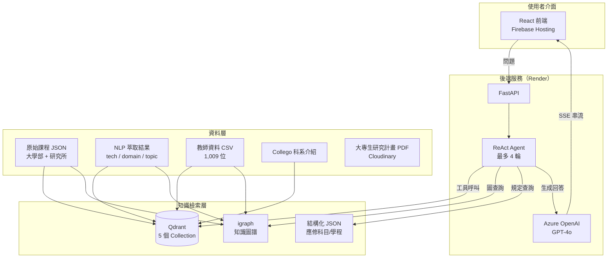

# 期中報告：NCU 科系探索系統 v2.0

> **系統名稱**：中央大學選課助理（NCU Course Advisor）  
> **報告日期**：2026-05-02  
> **對應期初報告**：`docs/01-initial-report/AI科系探索系統企劃書.md`

---

## 一、執行摘要

本期報告涵蓋期初報告（v1.2）後的全部系統演進，主要完成六大方向的工作：

| 方向 | 完成內容 | 詳細報告 |
|------|---------|---------|
| **資料擴充** | 整合四大新資料源（教師專長、科系介紹、應修科目、學分學程） | `01-data-expansion.md` |
| **NLP 萃取** | 四個 LLM Agent 萃取技術節點、領域標籤、主題、概念簡化 | `02-nlp-pipeline.md` |
| **知識圖譜** | 建立含 14,602 節點 / 29,567 邊的 NCU 全校知識圖譜 | `03-knowledge-graph.md` |
| **RAG 系統** | 5 個 Qdrant collection + 三層 Hybrid 搜尋架構 | `04-rag-system.md` |
| **ReAct Agent** | 14 工具 × ReAct 迴圈 × 零幻覺課程提取 | `05-react-agent.md` |
| **雲端部署** | Firebase + Render + Cloudinary 三層部署架構 | `06-deployment.md` |

---

## 二、系統演進：v1.2 → v2.0

### 功能對照

| 功能面向 | v1.2（期初） | v2.0（期中） |
|---------|------------|------------|
| 課程資料 | 3,630 門（processed JSON） | 大學部 + 研究所向量化，Qdrant 索引 |
| AI 搜尋 | RAG 基礎向量搜尋 | 三層 Hybrid（圖 + 向量 + RRF） |
| 對話系統 | 基礎 RAG Chatbot | ReAct Agent + 14 工具 + 零幻覺機制 |
| 資料來源 | 課程 JSON + PDF metadata | 新增教師CSV / Collego / 應修科目 / 學分學程 |
| 知識結構 | 無 | 知識圖譜（14,602 節點 / 29,567 邊） |
| 課程語意 | 課程目標/內容向量化 | NLP 萃取 Concept / Technology / Field 節點 |
| 修課資格 | 無 | 7,282 條 access_rule，支援複雜分發邏輯 |
| 部署 | 本地開發 | Firebase + Render + Cloudinary |
| 監控 | 無 | LangSmith（可選） |

---

## 三、整體技術架構



### 資料流：從原始資料到 ReAct Agent

```
原始資料
  ├─ data/raw/courses/114_1 + 114_2     → 大學部原始課程 JSON
  ├─ data/raw/graduate_courses/          → 研究所課程 JSON
  ├─ data/raw/114_ulistteacher.csv       → 教師專長
  ├─ data/raw/collego_ncu.json           → 科系介紹
  └─ 各系大專生計畫/*.pdf               → PDF（Cloudinary）

NLP 萃取（Qwen3-14B-AWQ）
  ├─ nlp_tech_nodes.json                 → 課程技術節點
  ├─ nlp_domain_tags.json               → 課程領域標籤
  ├─ nlp_professor_links.json           → 課程–教授關聯
  ├─ nlp_topic_tags.json                → 通識主題標籤
  └─ nlp_simplified_concepts.json       → 高中生友善概念

結構化整合
  ├─ curriculum_requirements_114.json   → 應修科目表（全系所）
  ├─ credit_programs/*.json             → 學分學程
  ├─ course_eligibility.json            → 修課資格（v3）
  └─ schedule_draft/                    → 建議修課學期

向量化 + 知識圖譜
  ├─ Qdrant ncu_courses_ug              → 大學部課程嵌入
  ├─ Qdrant ncu_courses_grad            → 研究所課程嵌入
  ├─ Qdrant ncu_teachers                → 教師嵌入
  ├─ Qdrant ncu_departments             → 系所介紹嵌入
  ├─ Qdrant ncu_credit_programs         → 學程嵌入
  └─ knowledge_graph.gpickle / .json   → 知識圖譜（igraph）

ReAct Agent（14 工具）
  └─ GPT-4o → SSE 串流 → 前端
```

---

## 四、量化成果摘要

### 知識圖譜規模

| 指標 | 數值 |
|------|------|
| 總節點 | **14,602** |
| 總邊 | **29,567**（含 SIMILAR_TO 後 34,631） |
| Course 節點（有完整資料） | 1,348 |
| Course stub 節點 | 127 |
| Instructor 節點（全量） | 1,021 |
| Field 節點（NLP 萃取） | 3,594 |
| Concept 節點（NLP 萃取） | 6,938 |
| Technology 節點 | 390 |

### 向量資料庫規模

| Qdrant Collection | 筆數 | 向量維度 | 說明 |
|-------------------|------|---------|------|
| `ncu_courses_ug` | ~1,400 | 3,072 | 大學部課程 |
| `ncu_courses_grad` | ~900 | 3,072 | 研究所課程 |
| `ncu_teachers` | 1,009 | 3,072 | 教師專長 |
| `ncu_departments` | ~40 | 3,072 | 系所介紹 |
| `ncu_credit_programs` | 42 | 3,072 | 學分學程 |

### Agent 工具數

| 分類 | 工具 | 數量 |
|------|------|------|
| 課程搜尋 | search_courses, get_course_detail, get_dept_courses | 3 |
| 系所 | get_dept_info, get_graduation_requirements | 2 |
| 學程 | search_programs, get_program_info | 2 |
| 教師 | search_teachers, get_teacher_info | 2 |
| 圖探索 | get_course_knowledge_map, find_similar_courses, get_depts_by_tech, ppr_explore, explore_concept_neighborhood | 5 |
| **合計** | | **14** |

---

## 五、期初後主要里程碑

| 時間 | 里程碑 |
|------|--------|
| 2026-04-07 | NLP 萃取策略設計（課程分類器 + 三種先修來源） |
| 2026-04-13 | NLP 萃取 Pipeline 完成（四個 Agent，~1,700 門課） |
| 2026-04-19 | 知識圖譜 v3 建置完成（14,602 節點 / 29,567 邊） |
| 2026-04-21 | SIMILAR_TO 同義邊補充（2,532 對，字串相似度） |
| 2026-04-23 | course_eligibility.json v3（7,282 條 access_rule） |
| 2026-04-25 | Qdrant 五個 collection 建立完成，NLP 欄位整合 |
| 2026-04-30 | curriculum Phase 2 完成（55 節點 merge，15,186 nodes） |
| 2026-05-01 | ReAct Agent 測試完成（T1~T5，首次 30s，快取 2.6s） |
| 2026-05-02 | get_program_info 整合（合併 description + courses） |

---

## 六、目錄結構（期中後更新）

```
project/
├── backend/
│   └── app/
│       ├── services/
│       │   ├── llm_service.py    ← ReAct Agent 主邏輯
│       │   ├── tools.py          ← 14 個工具實作
│       │   ├── retriever.py      ← Qdrant 查詢
│       │   ├── graph_service.py  ← igraph 查詢
│       │   └── session_store.py  ← 對話 session
│       └── routes/
│           ├── chat.py           ← SSE /api/chat/stream
│           ├── courses.py
│           └── graph.py
├── frontend/                     ← React 19 + Tailwind（三欄 Layout）
├── data/
│   ├── raw/
│   │   ├── courses/              ← 大學部課程 JSON
│   │   ├── graduate_courses/     ← 研究所課程 JSON
│   │   ├── 114_ulistteacher.csv  ← 教師資料（教育部）
│   │   └── collego_ncu.json      ← 系所介紹（Collego）
│   └── processed/
│       ├── graph/                ← knowledge_graph.gpickle / .json
│       ├── nlp/                  ← 5 個 NLP 輸出 JSON
│       ├── qdrant_data/          ← Qdrant 本地儲存
│       ├── curriculum_requirements_114.json
│       ├── credit_programs/      ← 42 個學程 JSON
│       ├── course_eligibility.json
│       └── schedule_draft/       ← 建議修課學期
└── scripts/
    ├── nlp/                      ← 4 個 Agent 腳本 + 後處理
    ├── graph/                    ← build_graph.py
    └── rag/                      ← build_vector_index.py
```
