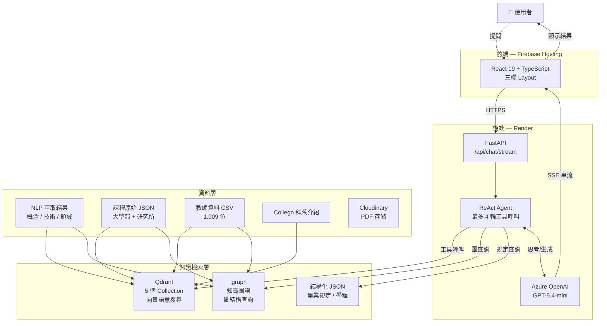
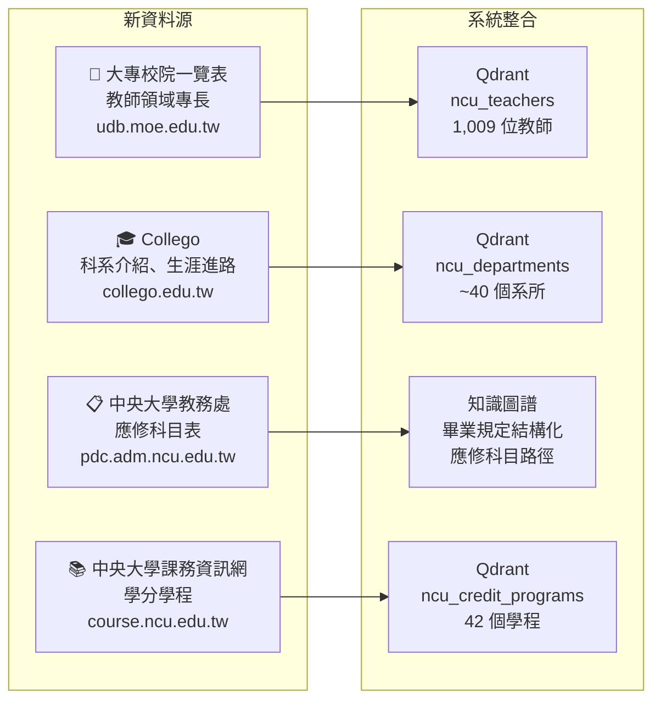
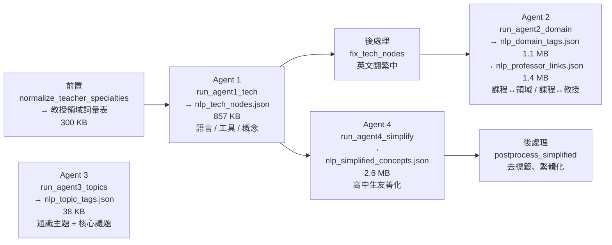
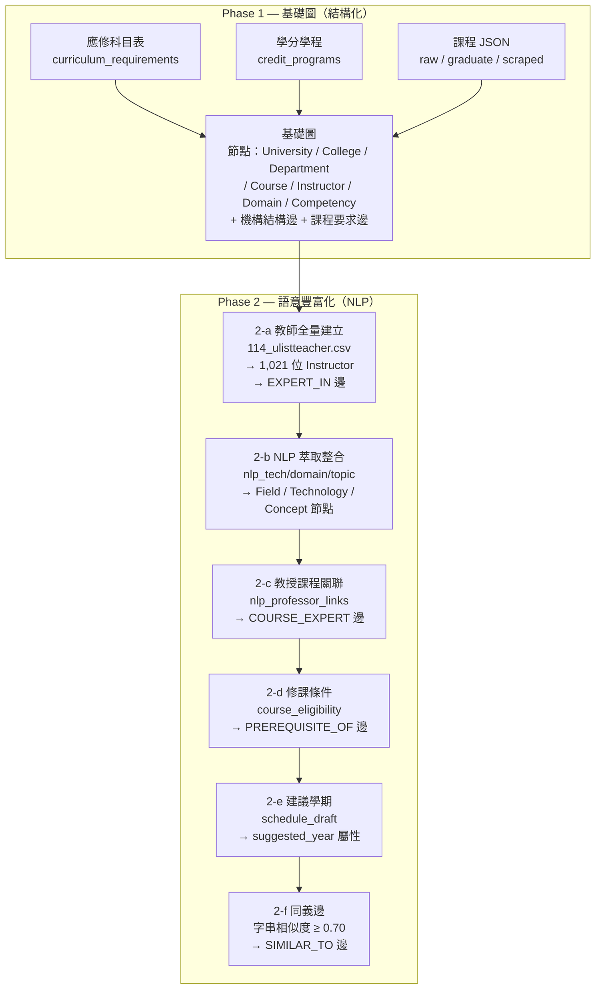
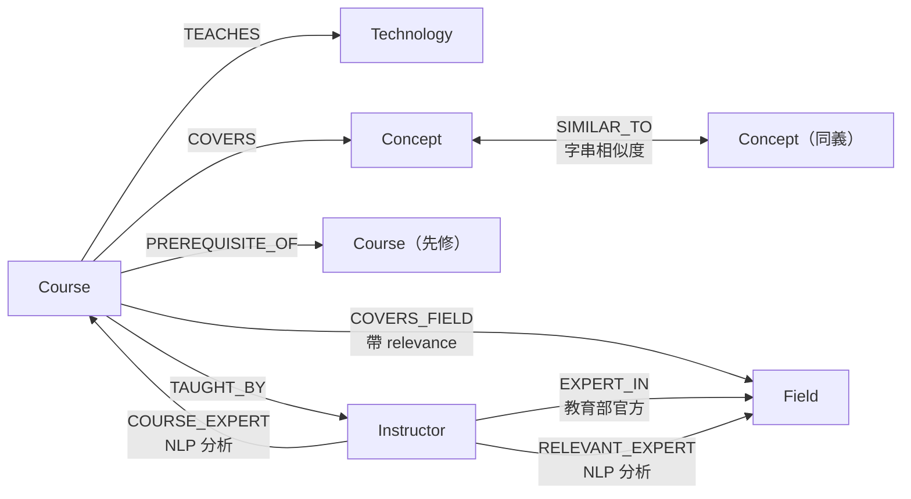
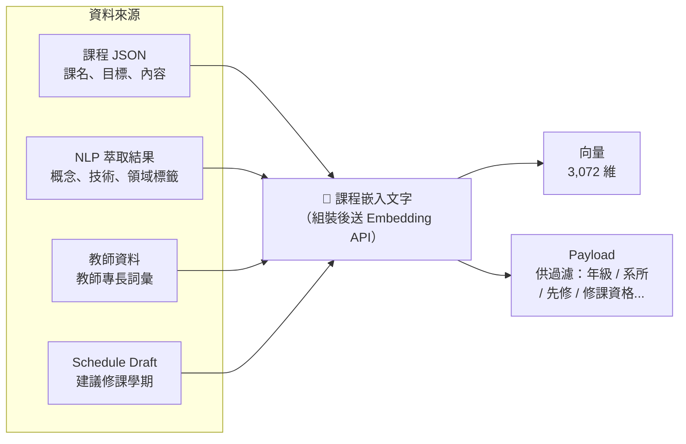
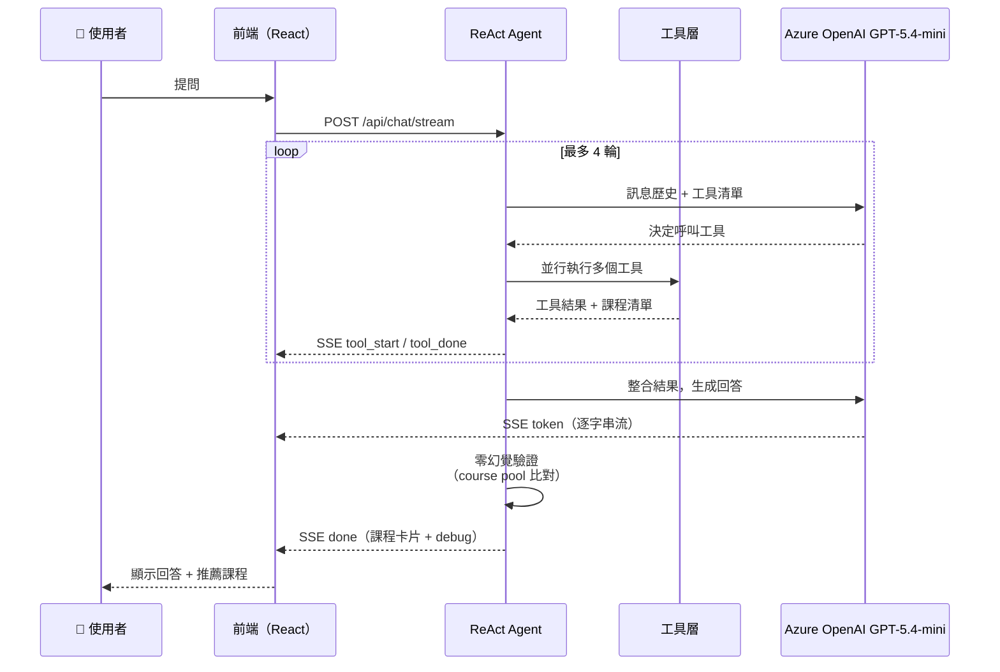
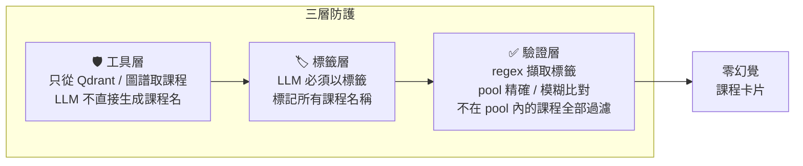
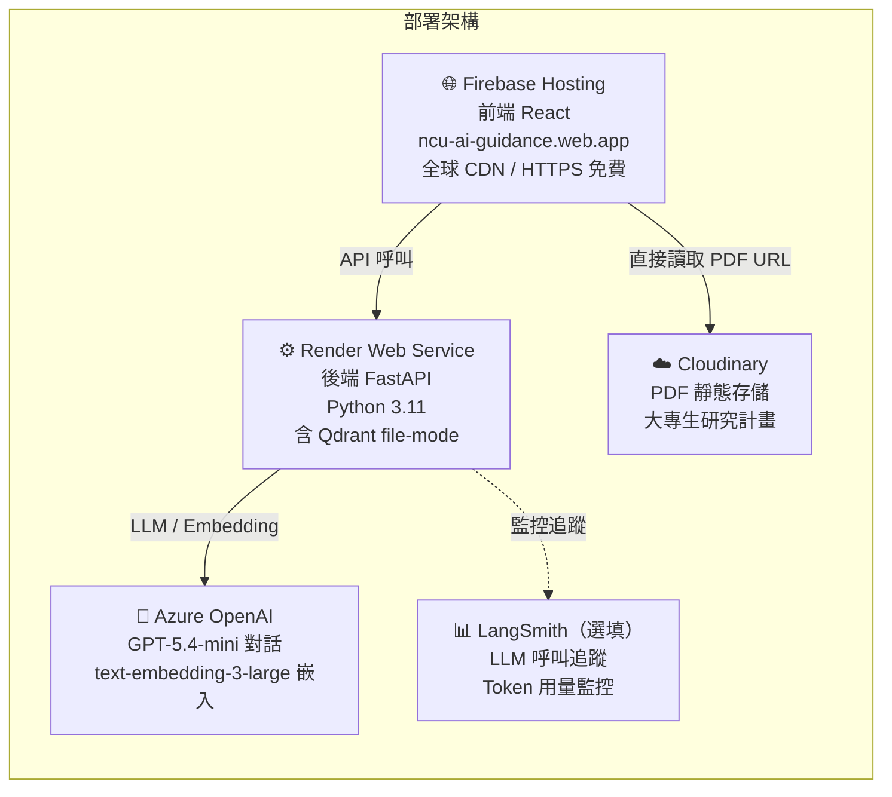

# NCU 科系探索系統 期中報告

> **系統名稱**：中央大學選課助理（NCU Course Advisor）  
> **報告日期**：2026-05-02  
> **版本**：v2.0（期初 v1.2 → 期中 v2.0）

---

## 一、執行摘要

### 1.1 系統定位

本系統以「AI 驅動」為核心，協助三類使用者：
- **高中生**：透過科系介紹、研究計畫探索，了解各學科領域與生涯方向
- **大學生**：透過 AI 對話規劃選課路徑、查詢修課資格、探索學分學程
- **家長**：快速取得中央大學各系所資訊與就業進路

### 1.2 期初 → 期中演進

```
期初 v1.2                          期中 v2.0
─────────────────────────────────────────────────────────
課程 JSON（3,630 門）         →  大學部 + 研究所完整索引
基礎 RAG 向量搜尋             →  三層 Hybrid 搜尋（圖 + 向量 + RRF）
單一 Chatbot                  →  ReAct Agent + 14 工具
課程原始資料                  →  NLP 萃取語意節點（概念 / 技術 / 領域）
無知識結構                    →  知識圖譜（14,602 節點 / 34,631 邊）
本地開發                      →  Firebase + Render + Cloudinary 雲端部署
```

### 1.3 量化成果一覽

| 指標 | 數值 |
|------|------|
| 知識圖譜節點 | **14,602** |
| 知識圖譜邊 | **34,631** |
| 向量索引 collections | **5 個** |
| Agent 工具數 | **14 個** |
| 教師節點（全量） | **1,021 位** |
| NLP 萃取概念節點 | **6,938 個** |
| 修課資格規則 | **7,282 條** |

---

## 二、整體技術架構



---

## 三、資料擴充

### 3.1 四大新資料源



### 3.2 資料規模

| 資料源 | 檔案 | 規模 |
|--------|------|------|
| 教師領域專長（教育部） | `114_ulistteacher.csv` | 1,009 位教師 / 2,469 個專長詞彙 |
| 科系介紹（Collego） | `collego_ncu.json` | ~40 個系所（特色、意涵、生涯進路） |
| 應修科目表（教務處） | `curriculum_requirements_114.json` | 28 個系所 / 458 門必修課 |
| 學分學程（課務資訊網） | `credit_programs/*.json` | 42 個學程 / 998 門課 |

### 3.3 PDF 資料處理流程

應修科目表與學分學程原始資料均為 PDF 文件，需經以下步驟轉為可程式化使用的 JSON：

```
原始 PDF
  ↓ 文字層萃取（Claude Read tool）
  ↓   → 相比傳統 OCR，CJK 字型辨識率更高
  ↓   → 保留表格列結構，不需額外版面分析
表格欄位對應
  ↓ 應修科目表：課名 / 學分 / 必選修屬性 / 修課年級
  ↓ 學分學程：學程名稱 / 必修門檻學分 / 選修課號清單
文字正規化
  ↓ NFKC 全形轉半形
  ↓ 統一標點（「、」→逗號等）
  ↓ 確保課號格式與 raw 課程 JSON 吻合
人工驗證
  ↓ 逐系所核對必修課單，修正 OCR 誤認（如「Ο」vs「0」）
  ↓ 補齊表格跨頁斷行遺漏
交叉比對
  ↓ 以課號比對 raw 課程資料集，記錄未命中條目
  → 未命中課號以 stub 節點方式保留在圖譜中
最終 JSON（curriculum_requirements_114.json / credit_programs/*.json）
```

### 3.4 資料品質驗證

```
應修科目表：28 系所驗證 → 92.9% 完整吻合
課號對應 raw 課程：455 / 458 → 99.3% 命中

學分學程：42 個學程驗證 → 97.6% 完整吻合
課號對應 raw 課程：932 / 998 → 93.4% 命中（補救後達 95.2%）
```

---

## 四、NLP 萃取 Pipeline

### 4.1 目的

課程原始 JSON 含自然語言文字，無法直接精確查詢（例如「哪些課教 Python？」）。使用本地 LLM（Qwen3-14B-AWQ）從課程內容萃取**結構化語意節點**。

### 4.2 課程分類策略

NLP 前先對每門課程指定類別，決定要執行哪些 Agent，避免無效呼叫：

| 類別 | 適用課程 | 執行動作 | 代表例子 |
|------|---------|---------|---------|
| `SKIP` | 體育課、軍訓課 | 跳過所有 NLP 萃取 | 大一體育、國防教育 |
| `SEQUENCE_ONLY` | 語言中心課程、服務學習 | 僅做序列命名先修推算 | 英文(一)(二)、服務學習(上)(下) |
| `TOPICS_ONLY` | 通識課程 | 僅執行 Agent 3 主題分類 | 人文、社會、自然通識課 |
| `FULL` | 其他學術課程 | Agent 1 + 2 + 4 完整萃取 | 資工、電機、機械等各系課程 |

### 4.3 四個 Agent 流程



| 輸出檔案 | 大小 | 說明 |
|---------|------|------|
| `dept_professor_map.json` | 300 KB | 1,009 位教師，2,469 個專長 |
| `nlp_tech_nodes.json` | 857 KB | 技術節點（語言/工具/概念） |
| `nlp_domain_tags.json` | 1.1 MB | 課程→研究領域標籤（high/medium/low） |
| `nlp_professor_links.json` | 1.4 MB | 課程→相關教授 |
| `nlp_topic_tags.json` | 38 KB | 通識課主題 + 核心議題問句 |
| `nlp_simplified_concepts.json` | 2.6 MB | 概念高中生友善化 |

### 4.4 先修關係三種來源

```
方法一：課號序列命名（規則式，覆蓋率最高）
  例：日文(一) → 日文(二) → 日文(三)
  例：微積分上 → 微積分下
  實測命中：114_1 共 133 門課，置信度 100%

方法二：分發條件年級推算（規則式）
  例：「年級:限一、二年級」→ eligible_years = [1, 2]
  用途：建議修課順序、年級層次先修推斷

方法三：LLM 推理（適用於有豐富授課內容的課程）
  例：授課內容隱含「假設學生已熟悉資料結構」
  僅對 FULL 類課程執行
```

> **關鍵發現**：明確文字標記的先修關係在 ~1,700 門課中只有 9 筆（< 0.5%），規則式 + LLM 多策略組合才能有效覆蓋。

---

## 五、知識圖譜建構

### 5.1 兩階段建置



### 5.2 節點類型總覽

```
機構結構節點（Phase 1）
  University → College → Department / CollegeBachelorProgram
  → DeptGroup / SpecializationTrack → CurriculumPlan
  → ElectiveGroup → Slot → Course
  → GraduationRule / Certification / CreditProgram

課程語意節點（Phase 1）
  Course → Instructor / Domain / Competency

語意豐富節點（Phase 2，NLP）
  Field（研究領域，細粒度）
  Technology（程式語言 / 框架 / 工具）
  Concept（學術概念）
```

### 5.3 邊類型概覽



### 5.4 三種語意節點的差異

| 節點 | 粒度 | 範例 | 建立方式 |
|------|------|------|---------|
| `Domain` | 粗（課程大領域） | 「人工智慧」、「資料科學」 | 課程綱要欄位直接取 |
| `Field` | 細（教師研究領域） | 「強化學習」、「衛星遙測」 | NLP 從教師專長萃取 |
| `Concept` | 細（課程涵蓋概念） | 「梯度下降」、「記憶體管理」 | NLP 從授課內容萃取 |
| `Technology` | 工具層 | 「PyTorch」、「Docker」 | NLP 從授課內容萃取 |

### 5.5 圖譜統計（2026-04-21）

| 類型 | Phase 1 | Phase 2 後 |
|------|---------|-----------|
| Course 節點（有完整資料） | 1,348 | 1,348（新增屬性） |
| Course stub 節點 | 127 | 127 |
| Instructor 節點 | 411 | **1,021**（全量補建） |
| Field 節點 | 0 | **3,594** |
| Concept 節點 | 0 | **6,938** |
| Technology 節點 | 0 | **390** |
| TEACHES 邊 | 0 | **633** |
| COVERS 邊 | 0 | **9,049** |
| COVERS_FIELD 邊 | 0 | **3,720** |
| EXPERT_IN 邊 | 0 | **2,629** |
| COURSE_EXPERT 邊 | 0 | **3,522** |
| PREREQUISITE_OF 邊 | 0 | **160** |
| SIMILAR_TO 邊 | 0 | **5,064** |
| TAUGHT_BY 邊 | 897 | 897 |
| DEVELOPS 邊 | 4,209 | 4,209 |
| **總節點** | — | **14,602** |
| **總邊** | — | **34,631** |

---

## 六、RAG 系統設計

### 6.1 五個向量 Collection

```
Qdrant（本地 file-mode）
  ├── ncu_courses_ug      大學部課程  ~1,400 筆  3,072 維
  ├── ncu_courses_grad    研究所課程  ~900 筆    3,072 維
  ├── ncu_teachers        教師資料    1,009 筆   3,072 維
  ├── ncu_departments     系所介紹    ~40 筆     3,072 維
  └── ncu_credit_programs 學分學程    42 筆      3,072 維
```

### 6.2 課程向量的組成

每門課程的嵌入文字整合多個來源：



### 6.3 修課資格 v3 架構

每門課可有**多條資格規則（OR 邏輯）**：

```
course_eligibility.json
  ├── is_unrestricted     → 全校皆可修
  ├── is_grad_only        → 純研究所課程
  ├── is_undergrad_open   → 大學部可修
  └── access_rules: [
        { 系所限制 / 年級限制 / 身份限制 },  ← 規則 1
        { 系所限制 / 年級限制 / 身份限制 },  ← 規則 2（OR）
        ...
      ]

統計（114 學年 3,765 個課號）：
  access_rules 總數  7,282 條
  有年級限制         1,748 門
  有先修要求          142 門
  純研究所課程       1,116 門
```

### 6.4 三層 Hybrid 搜尋架構

```mermaid
flowchart TD
    Q["使用者查詢"]

    TECH{"含技術參數？<br/>如 tech=Python"}
    GRAPH_EXACT["知識圖譜精確查詢<br/>TEACHES / COVERS 邊"]

    L1["Layer 1：Query Expansion<br/>在概念節點 collection 找語意相近概念<br/>擴展查詢字串"]

    L2A["Signal A<br/>向量搜尋（擴展查詢）"]
    L2B["Signal B<br/>向量搜尋（原始查詢）"]

    RRF["Layer 3：RRF 融合<br/>RRF(d) = Σ 1/(60 + rank)<br/>合併排名，取前 N 筆"]

    Q --> TECH
    TECH -->|是| GRAPH_EXACT
    TECH -->|否| L1
    L1 --> L2A
    L1 --> L2B
    L2A --> RRF
    L2B --> RRF
```



### 6.5 四種評分說明

| 分數 | 意義 | 越___越好 | 使用工具 |
|------|------|----------|---------|
| `distance`（餘弦距離） | 向量語意距離，0=完全相同 | **越小**越好 | search_courses / search_teachers 等 |
| `RRF score` | 多路信號排名融合，出現次數越多分越高 | **越大**越好 | search_courses / find_similar_courses |
| `shared_concepts` | 兩課程共享概念節點數量 | **越大**越好 | find_similar_courses / knowledge_map |
| `PPR score` | Personalized PageRank × 1000 | **越大**越好 | ppr_explore |

---

## 七、ReAct Agent 設計

### 7.1 對話主流程



### 7.2 14 個工具分類

```
課程搜尋類（3）
  ├── search_courses          語意搜尋課程（三層 Hybrid）
  ├── get_course_detail       完整課綱 + 修課資格 + 先修要求
  └── get_dept_courses        系所必修 / 選修清單

系所類（2）
  ├── get_dept_info           系所介紹（Collego）
  └── get_graduation_requirements  畢業規定

學程類（2）
  ├── search_programs         語意搜尋學分學程
  └── get_program_info        學程說明 + 課程清單

教師類（2）
  ├── search_teachers         語意搜尋教師
  └── get_teacher_info        教師詳情 + 開課清單

圖探索類（5）
  ├── get_course_knowledge_map  課程概念地圖
  ├── find_similar_courses      找共享概念最多的相似課程
  ├── get_depts_by_tech         查哪些系所教某技術
  ├── ppr_explore               Personalized PageRank 廣泛探索
  └── explore_concept_neighborhood  概念 N 跳鄰域探索
```

### 7.3 零幻覺機制



**效果**：使用者看到的課程卡片永遠是工具實際回傳、真實存在的課程。

### 7.4 前端三欄 Layout

```
┌──────────────┬────────────────────────────┬──────────────┐
│  左側欄      │       聊天區域              │  右側面板    │
│  320px       │       flex-1               │  280px       │
│              │                            │              │
│  歷史對話    │  訊息泡泡                  │  推薦課程    │
│  列表        │  （Markdown 渲染）         │  卡片列表    │
│  可新增      │  + DebugTracePanel         │              │
│  可刪除      │                            │  手機版隱藏  │
│  預設收合    │  輸入框                    │              │
└──────────────┴────────────────────────────┴──────────────┘
```

### 7.5 SSE 串流事件

```
tool_start  →  工具開始執行（顯示 loading）
tool_done   →  工具完成（顯示找到 N 筆課程）
token       →  LLM 逐字生成（即時顯示文字）
verify_done →  零幻覺驗證完成（顯示過濾結果）
done        →  全部完成（推送課程卡片 + debug trace）
```

---

## 八、雲端部署架構

### 8.1 三服務架構



### 8.2 各服務說明

| 服務 | 用途 | 方案 | 費用 |
|------|------|------|------|
| Firebase Hosting | 前端靜態部署 + CDN | Spark（免費） | $0 |
| Render | 後端 FastAPI 服務 | Free（750h/月） | $0（有休眠限制） |
| Cloudinary | PDF 靜態存儲 | Free（25 GB） | $0 |
| Azure OpenAI | GPT-5.4-mini 對話 + 嵌入 | Pay-as-you-go | ~$0.01/千 token |
| LangSmith | LLM 監控 | Developer（免費） | $0（5,000 traces/月） |
| **合計（開發期）** | | | **$0-5/月** |

### 8.3 資料流程

```
使用者 → Firebase（靜態前端）
        ↓ HTTPS API 請求
        Render（FastAPI 後端）
          ├── Qdrant file-mode（本地向量搜尋）
          ├── igraph（本地圖查詢）
          └── Azure OpenAI（雲端 LLM）
        ↓ SSE 串流回傳
使用者 ← Firebase（顯示結果）
```

---

## 九、測試結果

### 9.1 功能測試摘要

| 測試 | 查詢內容 | 耗時 | 結果 |
|------|---------|------|------|
| T1 語意偏移 | 「電腦如何看懂圖片」 | 30.3s（首次） | 電腦視覺類課程排前列，Query Expansion 有效 |
| T2 學院過濾 | 「資料結構」+ 資電學院 | 2.6s（快取） | 過濾正確，不被 query expansion 影響 |
| T3 跨學院融合 | 「機器學習」相似課程 | 21.4s | 資工、生醫、統計、財金皆有，RRF 有效 |
| T4 PPR 探索 | seed=「深度學習」 | 23.2s | 強相關前 4 筆自動截斷，去除尾部噪音 |
| T5 知識地圖 | 「人工智慧導論」 | 22.4s | 54 個概念節點，跨學院推薦有效 |

### 9.2 效能說明

```
首次查詢（冷啟動）：~20-30 秒
  原因：Qdrant 初始化 + Azure OpenAI Embedding API 呼叫

後續查詢（快取命中）：~2-3 秒
  原因：Embedding 結果 LRU 快取（maxsize=512）

igraph PPR 計算：~0.2 秒/次（已優化）
```

### 9.3 Bug 修復記錄

| Bug | 症狀 | 根因 | 修復 |
|-----|------|------|------|
| qdrant-client API 更新 | 向量搜尋靜默回傳空 list | v1.17.1 移除 `client.search()` | 改用 `client.query_points()` |
| Payload list 型別錯誤 | 顯示課程時 TypeError | `languages` 等欄位以 list 格式儲存 | 新增 helper 自動 join 轉字串 |

---

## 十、未來規劃

### 10.1 短期（1-2 個月）

```
□ 清理 dead code（舊版 RAG 函式）
□ 釐清工具邊界（避免 LLM 選錯工具）
□ 建立課程概念平均向量（.npz），提升搜尋精準度
□ 解決 Render 冷啟動問題（首次 30s 延遲）
```

### 10.2 中期（2-4 個月）

```
□ 高中生 / 大學生使用者測試
□ 根據真實使用回饋調整工具設計
□ 評估 Qdrant Cloud 遷移（解決冷啟動）
□ 添加課程比較功能（A 課 vs B 課）
```

### 10.3 長期（4 個月+）

```
□ 115 學年度課程資料更新自動化
□ 個人化功能（儲存對話歷史 / 選課計畫）
□ 多輪推薦精化（根據對話歷史調整策略）
□ 支援其他大學資料（橫向擴展）
```

---

## 附錄：關鍵文件索引

| 文件 | 路徑 | 說明 |
|------|------|------|
| 期初報告 | `docs/01-initial-report/AI科系探索系統企劃書.md` | v1.2 系統設計 |
| NLP 萃取詳細報告 | `docs/02-midterm-report/nlp_extraction_report.md` | Pipeline 執行紀錄 |
| 知識圖譜設計 v3 | `docs/02-midterm-report/knowledge_graph_v3.md` | 完整節點/邊設計 |
| 資料擴充報告 | `docs/02-midterm-report/01-data-expansion.md` | 四大資料源整合細節 |
| RAG 系統設計 | `docs/02-midterm-report/04-rag-system.md` | Collection 設計詳細 |
| Agent 工具設計 | `docs/04-agent-tool-design/` | 14 工具詳細說明 |
| 知識圖譜建構腳本 | `scripts/graph/build_graph.py` | Phase 1 + Phase 2 全流程 |
| 向量索引建構腳本 | `scripts/rag/build_vector_index.py` | 5 個 Collection 建立 |
| Agent 主邏輯 | `backend/app/services/llm_service.py` | ReAct 迴圈實作 |
| 工具實作 | `backend/app/services/tools.py` | 14 工具完整實作 |
