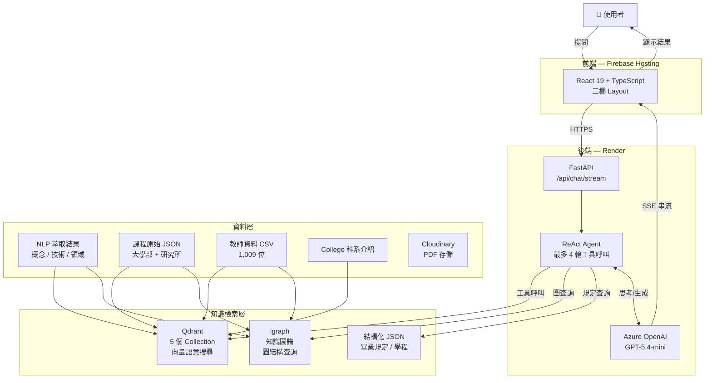
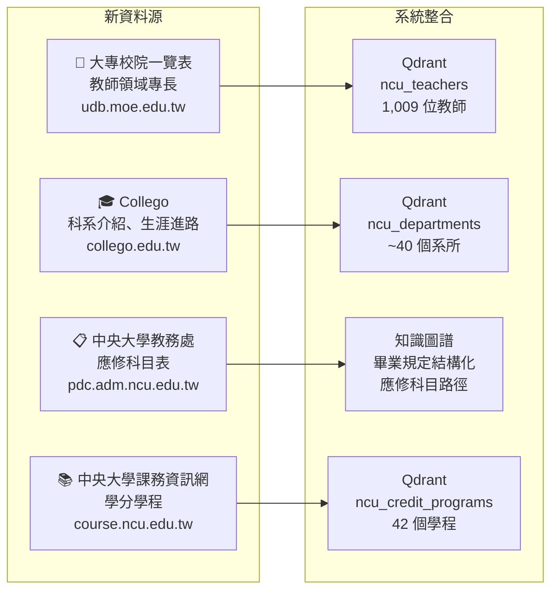
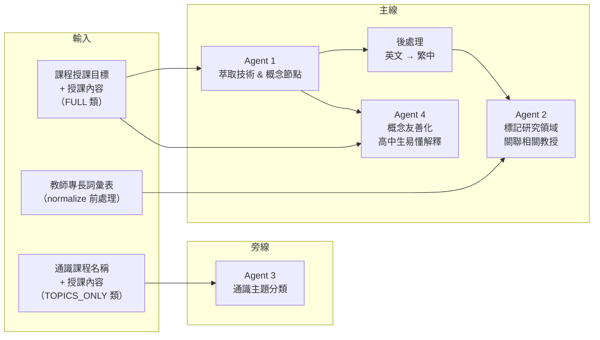
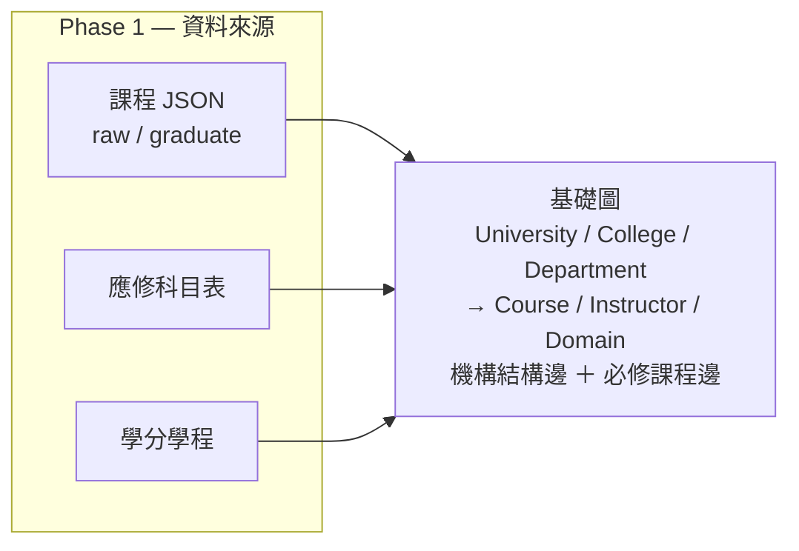
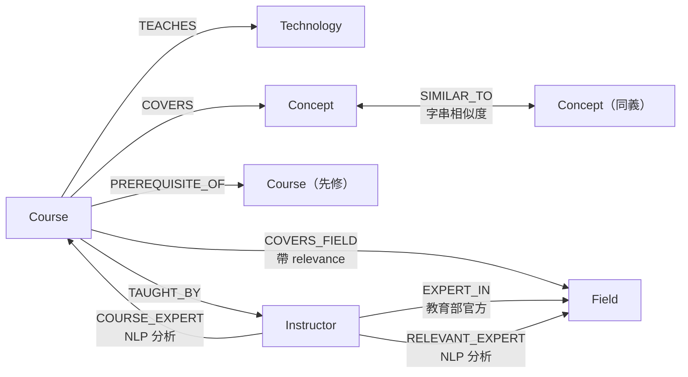
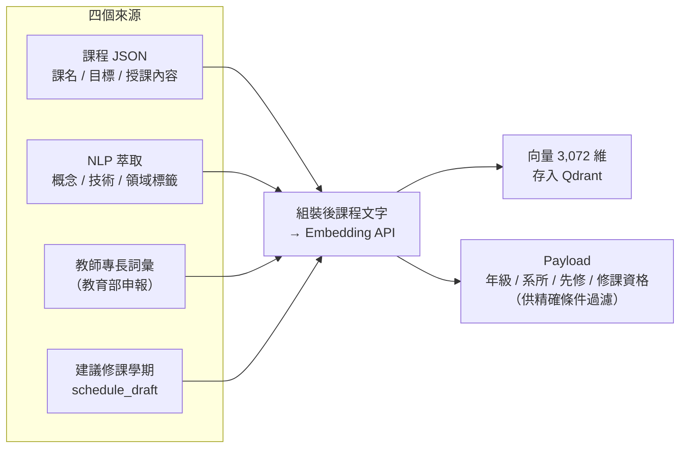
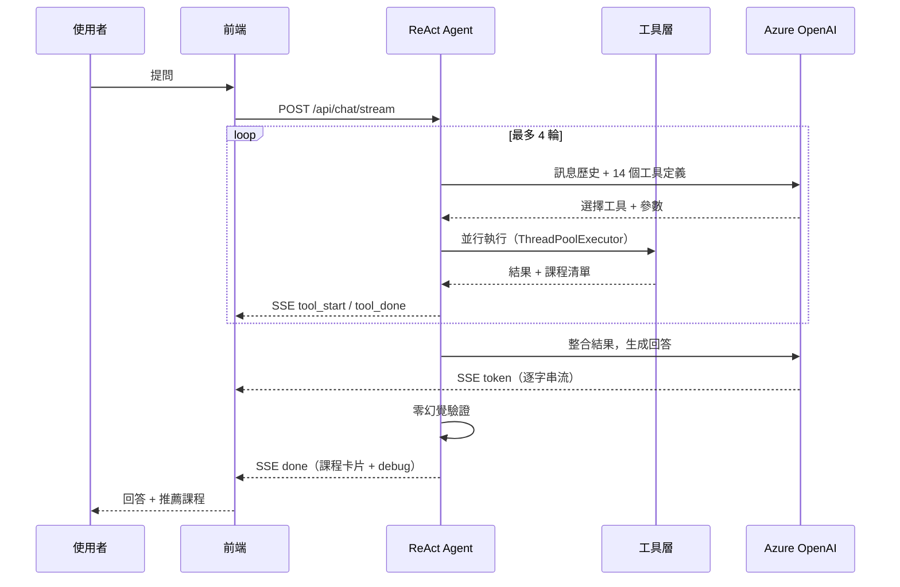
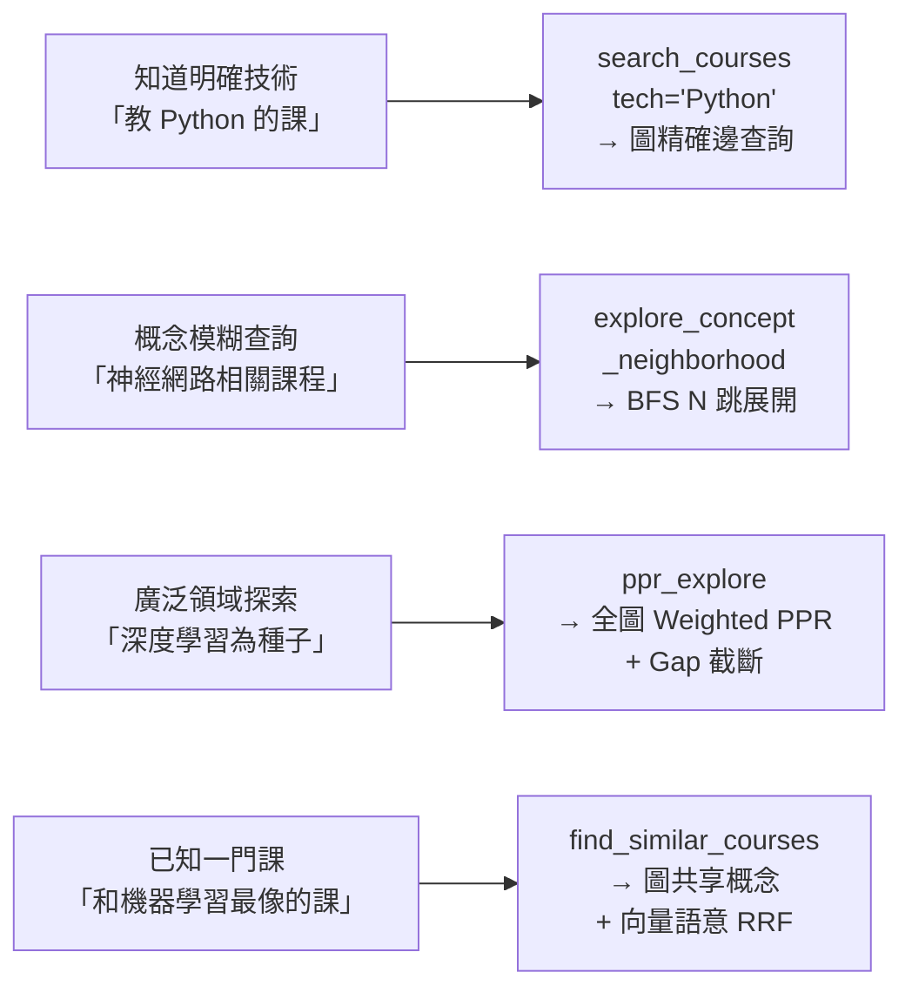
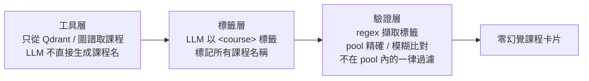
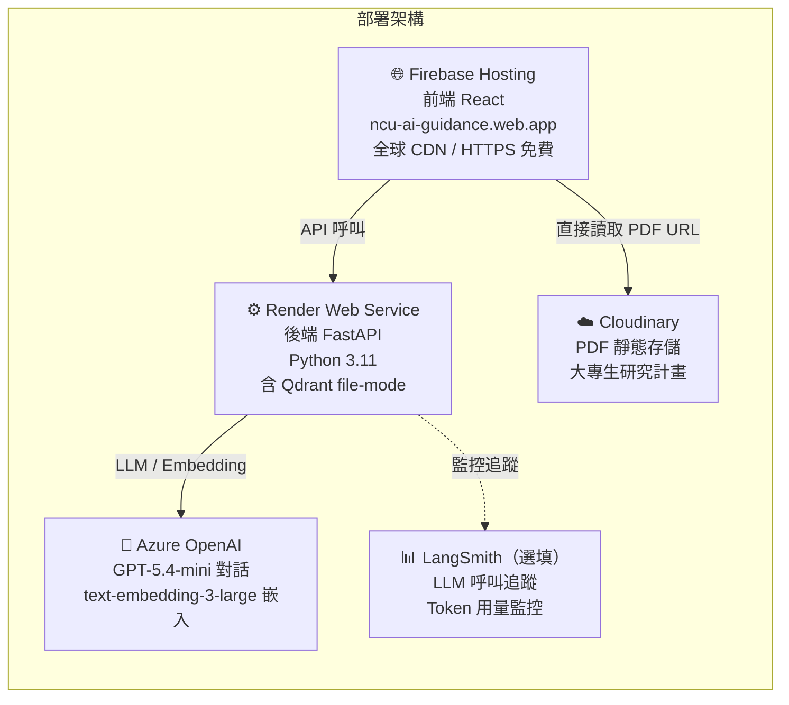

# NCU 科系探索系統 期中報告

> **系統名稱**：中央大學選課助理（NCU Course Advisor）  
> **報告日期**：2026-05-03  
> **版本**：v2.0（期初 v1.2 → 期中 v2.0）

---

## 一、執行摘要

### 1.1 系統定位

本系統以「AI 驅動」為核心，協助三類使用者：
- **高中生**：透過科系介紹、研究計畫探索，了解各學科領域與生涯方向
- **大學生**：透過 AI 對話規劃選課路徑、查詢修課資格、探索學分學程
- **家長**：快速取得中央大學各系所資訊與就業進路

### 1.2 期初 → 期中演進

```
期初 v1.2                          期中 v2.0
─────────────────────────────────────────────────────────
課程 JSON（3,630 門）         →  大學部 + 研究所完整索引
基礎 RAG 向量搜尋             →  三層 Hybrid 搜尋（圖 + 向量 + RRF）
單一 Chatbot                  →  ReAct Agent + 14 工具
課程原始資料                  →  NLP 萃取語意節點（概念 / 技術 / 領域）
無知識結構                    →  知識圖譜（15,186 節點 / 37,055 邊）
本地開發                      →  Firebase + Render + Cloudinary 雲端部署
```

### 1.3 量化成果一覽

| 指標 | 數值 |
|------|------|
| 知識圖譜節點 | **15,186** |
| 知識圖譜邊 | **37,055** |
| 向量索引 collections | **6 個** |
| Agent 工具數 | **14 個** |
| 教師節點（全量） | **1,023 位** |
| NLP 萃取概念節點 | **7,286 個** |
| 修課資格規則 | **7,282 條** |

---

## 二、整體技術架構



---

## 三、資料擴充

### 3.1 四大新資料源



### 3.2 資料規模

| 資料源 | 檔案 | 規模 |
|--------|------|------|
| 教師領域專長（教育部） | `114_ulistteacher.csv` | 1,009 位教師 / 2,469 個專長詞彙 |
| 科系介紹（Collego） | `collego_ncu.json` | ~40 個系所（特色、意涵、生涯進路） |
| 應修科目表（教務處） | `curriculum_requirements_114.json` | 28 個系所 / 458 門必修課 |
| 學分學程（課務資訊網） | `credit_programs/*.json` | 42 個學程 / 998 門課 |

### 3.3 PDF 資料處理流程

應修科目表與學分學程原始資料均為 PDF 文件，需經以下步驟轉為可程式化使用的 JSON：

```
原始 PDF
  ↓ 文字層萃取（Claude Read tool）
  ↓   → 相比傳統 OCR，CJK 字型辨識率更高
  ↓   → 保留表格列結構，不需額外版面分析
表格欄位對應
  ↓ 應修科目表：課名 / 學分 / 必選修屬性 / 修課年級
  ↓ 學分學程：學程名稱 / 必修門檻學分 / 選修課號清單
文字正規化
  ↓ NFKC 全形轉半形
  ↓ 統一標點（「、」→逗號等）
  ↓ 確保課號格式與 raw 課程 JSON 吻合
人工驗證
  ↓ 逐系所核對必修課單，修正 OCR 誤認（如「Ο」vs「0」）
  ↓ 補齊表格跨頁斷行遺漏
交叉比對
  ↓ 以課號比對 raw 課程資料集，記錄未命中條目
  → 未命中課號以 stub 節點方式保留在圖譜中
最終 JSON（curriculum_requirements_114.json / credit_programs/*.json）
```

### 3.4 資料品質驗證

```
應修科目表：28 系所驗證 → 92.9% 完整吻合
課號對應 raw 課程：455 / 458 → 99.3% 命中

學分學程：42 個學程驗證 → 97.6% 完整吻合
課號對應 raw 課程：932 / 998 → 93.4% 命中（補救後達 95.2%）
```

---

## 四、NLP 萃取 Pipeline

### 4.1 目的

課程原始 JSON 含自然語言文字，無法直接精確查詢（例如「哪些課教 Python？」）。使用本地 LLM（Qwen3-14B-AWQ）從課程內容萃取**結構化語意節點**。

### 4.2 課程分類策略

NLP 前先對每門課程指定類別，決定要執行哪些 Agent，避免無效呼叫：

| 類別 | 適用課程 | 執行動作 | 代表例子 |
|------|---------|---------|---------|
| `SKIP` | 體育課、軍訓課 | 跳過所有 NLP 萃取 | 大一體育、國防教育 |
| `SEQUENCE_ONLY` | 語言中心課程、服務學習 | 僅做序列命名先修推算 | 英文(一)(二)、服務學習(上)(下) |
| `TOPICS_ONLY` | 通識課程 | 僅執行 Agent 3 主題分類 | 人文、社會、自然通識課 |
| `FULL` | 其他學術課程 | Agent 1 + 2 + 4 完整萃取 | 資工、電機、機械等各系課程 |

### 4.3 四個 Agent 的資料流

四個 Agent 分成兩條路線並行：主線處理 FULL 類學術課程，旁線獨立處理通識課：



| Agent | 輸入 | 輸出 | 適用類別 |
|-------|------|------|---------|
| **Agent 1** | 課程授課目標 + 內容（原文） | 每門課的**技術節點**（語言/框架/工具）與**概念節點**（學術概念） | FULL |
| **Agent 2** | 課程 + Agent 1 技術節點 + 教師詞彙表 | 課程↔研究領域關係（high/medium/low） | FULL |
| **Agent 3** | 通識課程名稱 + 授課內容（原文） | 主題標籤（人文 / 社會 / 自然 / 藝術等）+ 核心議題問句 | TOPICS_ONLY |
| **Agent 4** | Agent 1 輸出的概念節點（專業術語） | 每個概念對應的高中生友善解釋 | FULL |

### 4.4 先修關係三種來源

```
方法一：課號序列命名（規則式，覆蓋率最高）
  例：日文(一) → 日文(二) → 日文(三)
  例：微積分上 → 微積分下
  實測命中：114_1 共 133 門課，置信度 100%

方法二：分發條件年級推算（規則式）
  例：「年級:限一、二年級」→ eligible_years = [1, 2]
  用途：建議修課順序、年級層次先修推斷

方法三：LLM 推理（適用於有豐富授課內容的課程）
  例：授課內容隱含「假設學生已熟悉資料結構」
  僅對 FULL 類課程執行
```

> **關鍵發現**：明確文字標記的先修關係在 ~1,700 門課中只有 9 筆（< 0.5%），規則式 + LLM 多策略組合才能有效覆蓋。

---

## 五、知識圖譜建構

### 5.1 兩階段建置

**Phase 1** 以結構化資料建立骨架；**Phase 2** 以 NLP 結果與額外資料源補入語意。



Phase 2 在基礎圖上依序補入語意（各步驟均依賴 Phase 1 結果，彼此獨立）：

| 步驟 | 資料來源 | 新增到圖譜 |
|------|---------|-----------|
| 2-a 教師全量補建 | `114_ulistteacher.csv` | 1,021 個 Instructor 節點 ＋ EXPERT_IN 邊 |
| 2-b NLP 語意節點 | nlp_tech / domain / topic JSON | Field / Technology / Concept 節點 ＋ COVERS / TEACHES / COVERS_FIELD 邊 |
| 2-c 教授課程關聯 | `nlp_professor_links.json` | COURSE_EXPERT 邊 |
| 2-d 修課先修條件 | `course_eligibility.json` | PREREQUISITE_OF 邊 |
| 2-e 建議修課學期 | `schedule_draft` JSON | Course 節點 `suggested_year` 屬性 |
| 2-f 同義概念邊 | 字串相似度（Jaro-Winkler ≥ 0.70） | **5,064 條** SIMILAR_TO 邊 |

### 5.2 節點類型總覽

```
機構結構節點（Phase 1）
  University → College → Department / CollegeBachelorProgram
  → DeptGroup / SpecializationTrack → CurriculumPlan
  → ElectiveGroup → Slot → Course
  → GraduationRule / Certification / CreditProgram

課程語意節點（Phase 1）
  Course → Instructor / Domain / Competency

語意豐富節點（Phase 2，NLP）
  Field（研究領域，細粒度）
  Technology（程式語言 / 框架 / 工具）
  Concept（學術概念）
```

### 5.3 邊類型概覽



### 5.4 三種語意節點的差異

| 節點 | 粒度 | 範例 | 建立方式 |
|------|------|------|---------|
| `Domain` | 粗（課程大領域） | 「人工智慧」、「資料科學」 | 課程綱要欄位直接取 |
| `Field` | 細（教師研究領域） | 「強化學習」、「衛星遙測」 | NLP 從教師專長萃取 |
| `Concept` | 細（課程涵蓋概念） | 「梯度下降」、「記憶體管理」 | NLP 從授課內容萃取 |
| `Technology` | 工具層 | 「PyTorch」、「Docker」 | NLP 從授課內容萃取 |

### 5.5 圖譜統計

**總節點 15,186 個 ／ 總邊 37,055 條**

**節點組成**

| 節點類型 | 數量 | 說明 |
|---------|------|------|
| Concept | **7,286** | NLP 從授課內容萃取的學術概念（最大節點類） |
| Field | **3,594** | 教師研究領域（細粒度，由教師專長 NLP 萃取） |
| Course | **1,581** | 課程節點（含少量 stub） |
| Instructor | **1,023** | 教師節點（全量補建） |
| Technology | **441** | 程式語言 / 框架 / 工具 |
| Competency | 224 | 課程培養的能力標籤 |
| Domain | 216 | 課程所屬大領域（粗粒度） |
| CreditProgram | 42 | 學分學程 |
| 其他機構結構 | 779 | GraduationRule / ElectiveGroup / Department / College 等 |

**主要邊類型**

| 邊類型 | 數量 | 意義 |
|-------|------|------|
| COVERS | 9,515 | 課程涵蓋概念 |
| SIMILAR_TO | 5,268 | 同義 / 相關概念（字串相似度） |
| DEVELOPS | 4,779 | 課程培養能力 |
| COVERS_FIELD | 3,911 | 課程對應研究領域 |
| COURSE_EXPERT | 3,705 | 教授擅長課程（NLP 分析） |
| EXPERT_IN | 2,629 | 教師官方研究領域（教育部申報） |
| 其他 | 7,248 | REQUIRES / PREREQUISITE_OF / TAUGHT_BY / 機構結構邊等 |

---

## 六、向量檢索基礎設施

### 6.1 Collection 設計

系統使用 6 個 Qdrant Collection，各自服務不同場景：

| Collection | 筆數 | 用於哪些工具 |
|-----------|------|------------|
| `ncu_courses_ug` | 3,627 | `search_courses`、`get_course_detail`、`get_dept_courses`（fallback） |
| `ncu_courses_grad` | 930 | `search_courses`（is_grad=True）、`get_course_detail` |
| `ncu_teachers` | 1,009 | `search_teachers`、`get_teacher_info` |
| `ncu_departments` | 32 | `get_dept_info` |
| `ncu_credit_programs` | 42 | `search_programs` |
| `ncu_graph_nodes` | 12,388 | `search_courses`（Query Expansion 種子）、`explore_concept_neighborhood`（BFS 入口） |

> 所有向量維度 **3,072**（Azure text-embedding-3-large）；以本地 file-mode 運行於 Render。

### 6.2 課程向量的資料組成

課程向量不只嵌入原始課綱，還整合 NLP 萃取結果與教師專長，讓向量能捕捉到概念層與技術層的語意：



### 6.3 修課資格規則庫

每門課可有**多條資格規則（OR 邏輯）**，由 `get_course_detail` 工具直接回傳原文，供 LLM 理解：

```
course_eligibility.json  ─  114 學年 3,765 個課號

  is_unrestricted      全校皆可修
  is_grad_only         純研究所課程
  is_undergrad_open    大學部可修
  access_rules: [
    { 系所限制 / 年級限制 / 身份限制 },   ← 規則 1
    { 系所限制 / 年級限制 / 身份限制 },   ← 規則 2（OR）
  ]

統計：access_rules 7,282 條 ／ 有年級限制 1,748 門 ／ 純研究所 1,116 門
```

---

## 七、ReAct Agent 與搜尋工具

### 7.1 對話主流程



### 7.2 14 個工具

| 類別 | 工具 | 典型問法 |
|------|------|---------|
| **課程搜尋** | `search_courses` | 「有哪些 AI 相關課程？」「哪些課教 Python？」 |
| | `get_course_detail` | 「演算法有哪些修課限制？課程內容是什麼？」 |
| | `get_dept_courses` | 「資工系有哪些必修課？」 |
| **系所** | `get_dept_info` | 「電機系在學什麼？畢業能做什麼？」 |
| | `get_graduation_requirements` | 「資工系要修幾學分才能畢業？」 |
| **學程** | `search_programs` | 「有哪些 AI 相關的學分學程？」 |
| | `get_program_info` | 「人工智慧技術應用學程要修哪些課？」 |
| **教師** | `search_teachers` | 「哪些老師研究強化學習？」 |
| | `get_teacher_info` | 「王小明教授開了哪些課？研究什麼？」 |
| **圖探索** | `get_course_knowledge_map` | 「人工智慧導論涵蓋哪些概念？有哪些相關課？」 |
| | `find_similar_courses` | 「有什麼課和機器學習類似？」 |
| | `get_depts_by_tech` | 「哪些系所的課有用到 GIS？」 |
| | `ppr_explore` | 「以深度學習為起點，探索整個相關領域」 |
| | `explore_concept_neighborhood` | 「神經網路概念周邊有哪些課？」 |

圖探索類五個工具的選用邏輯詳見 7.4。

### 7.3 `search_courses` 的搜尋機制

`search_courses` 是呼叫頻率最高的工具，內部採三層設計，解決「查詢字眼和課程名稱不直接吻合」的問題：

**一般語意查詢：三層流程**

```
輸入：「電腦如何看懂圖片」
────────────────────────────────────────────────
Layer 1  Query Expansion（圖輔助擴展）
         在 ncu_graph_nodes collection 找最近概念
         → 「電腦視覺」「影像辨識」「卷積神經網路」
         拼接成 expanded_query
────────────────────────────────────────────────
Layer 2  雙路向量搜尋
         Signal A：搜尋 expanded_query（語意偏移補救）
         Signal B：搜尋原始查詢（保留原始意圖）
         各取 n×2 筆候選
────────────────────────────────────────────────
Layer 3  RRF 融合（Reciprocal Rank Fusion，k=60）
         score = 1/(60+rankA) + 1/(60+rankB)
         兩路同時命中的課程得分倍增，取前 n 筆
────────────────────────────────────────────────
輸出：「電腦視覺」「圖形識別」「數位影像處理」...
      T1 實測：5/5 命中，無任何關鍵字直接吻合
```

**技術精確查詢：圖優先路徑**

傳入 `tech="Python"` 時，略過三層 Hybrid，改走知識圖譜 `TEACHES`/`COVERS` 精確邊，結果確定性更高。

### 7.4 圖探索工具：四種查詢模式

五個圖探索工具對應四種不同需求，依據問題類型選用：



| 工具 | 策略 | 精準 | 廣度 | 最適情境 |
|------|------|:----:|:----:|---------|
| `search_courses(tech=...)` | 圖精確邊 | ★★★★★ | ★★ | 明確技術名稱 |
| `explore_concept_neighborhood` | BFS N 跳 | ★★★★ | ★★★ | 概念鄰域課程探索 |
| `ppr_explore` | 全圖 PPR | ★★★ | ★★★★★ | 廣泛擴散、找隱性關聯 |
| `find_similar_courses` | 圖 + 向量 RRF | ★★★★ | ★★★★ | 跨系相似課程推薦 |

`ppr_explore` 採 Gap Truncation（mean − 0.5σ）自動截斷低分尾部，避免雜訊節點混入結果。`find_similar_courses("機器學習")` 實測跨資工、生醫、統計、財金等 6 個學院，圖路徑與向量路徑互補。

### 7.5 零幻覺防護



使用者看到的推薦卡片，永遠是工具實際回傳、資料庫中確實存在的課程。

### 7.6 前端介面

**三欄 Layout**

```
┌─────────────┬──────────────────────────┬────────────┐
│  歷史對話   │     聊天區域（flex-1）    │  推薦課程  │
│  320px      │  Markdown 渲染訊息泡泡   │  280px     │
│  可新增刪除 │  + Debug Trace Panel    │  卡片列表  │
│  預設收合   │  輸入框                  │  手機版隱藏│
└─────────────┴──────────────────────────┴────────────┘
```

**SSE 串流事件序列**

```
tool_start  →  工具開始執行（顯示 loading 動畫）
tool_done   →  工具完成（顯示找到 N 筆課程）
token       →  LLM 逐字生成（即時顯示文字）
verify_done →  零幻覺驗證完成
done        →  全部完成（推送課程卡片 + debug trace）
```

---

## 八、雲端部署架構

### 8.1 三服務架構



### 8.2 各服務說明

| 服務 | 用途 | 方案 | 費用 |
|------|------|------|------|
| Firebase Hosting | 前端靜態部署 + CDN | Spark（免費） | $0 |
| Render | 後端 FastAPI 服務 | Free（750h/月） | $0（有休眠限制） |
| Cloudinary | PDF 靜態存儲 | Free（25 GB） | $0 |
| Azure OpenAI | GPT-5.4-mini 對話 + 嵌入 | Pay-as-you-go | ~$0.01/千 token |
| LangSmith | LLM 監控 | Developer（免費） | $0（5,000 traces/月） |
| **合計（開發期）** | | | **$0-5/月** |

### 8.3 資料流程

```
使用者 → Firebase（靜態前端）
        ↓ HTTPS API 請求
        Render（FastAPI 後端）
          ├── Qdrant file-mode（本地向量搜尋）
          ├── igraph（本地圖查詢）
          └── Azure OpenAI（雲端 LLM）
        ↓ SSE 串流回傳
使用者 ← Firebase（顯示結果）
```

---

## 九、測試結果

### 9.1 功能測試摘要

| 測試 | 查詢內容 | 耗時 | 結果 |
|------|---------|------|------|
| T1 語意偏移 | 「電腦如何看懂圖片」 | 30.3s（首次） | 電腦視覺類課程排前列，Query Expansion 有效 |
| T2 學院過濾 | 「資料結構」+ 資電學院 | 2.6s（快取） | 過濾正確，不被 query expansion 影響 |
| T3 跨學院融合 | 「機器學習」相似課程 | 21.4s | 資工、生醫、統計、財金皆有，RRF 有效 |
| T4 PPR 探索 | seed=「深度學習」 | 23.2s | 強相關前 4 筆自動截斷，去除尾部噪音 |
| T5 知識地圖 | 「人工智慧導論」 | 22.4s | 54 個概念節點，跨學院推薦有效 |

### 9.2 效能說明

```
首次查詢（冷啟動）：~20-30 秒
  原因：Qdrant 初始化 + Azure OpenAI Embedding API 呼叫

後續查詢（快取命中）：~2-3 秒
  原因：Embedding 結果 LRU 快取（maxsize=512）

igraph PPR 計算：~0.2 秒/次（已優化）
```

### 9.3 Bug 修復記錄

| Bug | 症狀 | 根因 | 修復 |
|-----|------|------|------|
| qdrant-client API 更新 | 向量搜尋靜默回傳空 list | v1.17.1 移除 `client.search()` | 改用 `client.query_points()` |
| Payload list 型別錯誤 | 顯示課程時 TypeError | `languages` 等欄位以 list 格式儲存 | 新增 helper 自動 join 轉字串 |

---

## 十、未來規劃

### 10.1 短期（1-2 個月）

```
□ 清理 dead code（舊版 RAG 函式）
□ 釐清工具邊界（避免 LLM 選錯工具）
□ 建立課程概念平均向量（.npz），提升搜尋精準度
□ 解決 Render 冷啟動問題（首次 30s 延遲）
```

### 10.2 中期（2-4 個月）

```
□ 高中生 / 大學生使用者測試
□ 根據真實使用回饋調整工具設計
□ 評估 Qdrant Cloud 遷移（解決冷啟動）
□ 添加課程比較功能（A 課 vs B 課）
```

### 10.3 長期（4 個月+）

```
□ 115 學年度課程資料更新自動化
□ 個人化功能（儲存對話歷史 / 選課計畫）
□ 多輪推薦精化（根據對話歷史調整策略）
□ 支援其他大學資料（橫向擴展）
```

---

## 附錄：關鍵文件索引

| 文件 | 路徑 | 說明 |
|------|------|------|
| 期初報告 | `docs/01-initial-report/AI科系探索系統企劃書.md` | v1.2 系統設計 |
| NLP 萃取詳細報告 | `docs/02-midterm-report/nlp_extraction_report.md` | Pipeline 執行紀錄 |
| 知識圖譜設計 v3 | `docs/02-midterm-report/knowledge_graph_v3.md` | 完整節點/邊設計 |
| 資料擴充報告 | `docs/02-midterm-report/01-data-expansion.md` | 四大資料源整合細節 |
| RAG 系統設計 | `docs/02-midterm-report/04-rag-system.md` | Collection 設計詳細 |
| Agent 工具設計 | `docs/04-agent-tool-design/` | 14 工具詳細說明 |
| 知識圖譜建構腳本 | `scripts/graph/build_graph.py` | Phase 1 + Phase 2 全流程 |
| 向量索引建構腳本 | `scripts/rag/build_vector_index.py` | 5 個 Collection 建立 |
| Agent 主邏輯 | `backend/app/services/llm_service.py` | ReAct 迴圈實作 |
| 工具實作 | `backend/app/services/tools.py` | 14 工具完整實作 |
