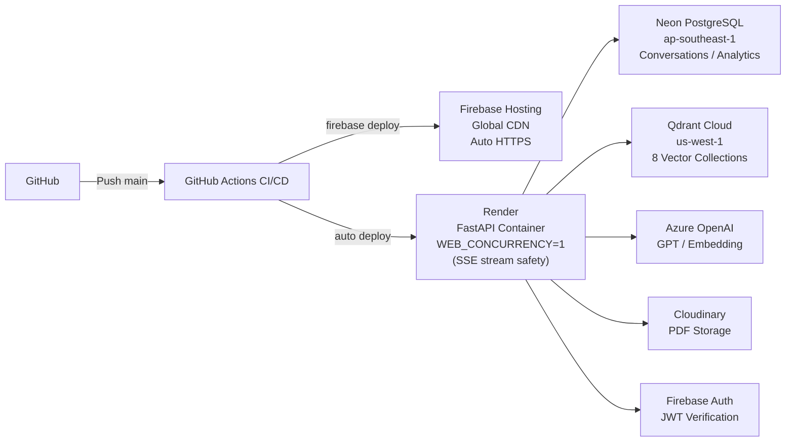

# AI Cross-Domain Application Project — Final Presentation

> Recommended tools: Marp / reveal.js / Gamma  
> Estimated duration: 15–20 min (excluding live demo)  
> Total slides: 18  
> `---` = slide break

---

---

# Slide 1｜Cover

```
National Central University
AI Cross-Domain Application Project

AI Course Assistant & College Student Research Scholarship (CSRS) Platform

Date: 2026-06-XX
Advisor: Prof. XXX
Team: XXX · XXX · XXX
```

> **Design note**: Dark navy background, white text, NCU logo bottom-right

---

---

# Slide 2｜What Problem Are We Solving?

**High school students have almost no direct way to understand university.**

Course info is scattered  ·  Research is inaccessible  ·  Department guides scratch only the surface

**We built an AI platform that changes that.**

  →  Ask about any NCU course in plain language
  →  Browse real undergraduate research projects by department
  →  Take an AI-generated interest quiz, get department recommendations
  →  Discover how your learning curiosity evolves over time

*Interactive  ·  Conversational  ·  No prior knowledge needed*

---

---

# Slide 3｜Two Product Lines

```
┌──────────────────────────────────────────────────────────────┐
│                    Shared Infrastructure                      │
│       Azure OpenAI · Qdrant · PostgreSQL · Firebase Auth     │
├───────────────────────────────┬──────────────────────────────┤
│   AI Course Assistant         │   CSRS System                │
│                               │                              │
│  LLM + Knowledge Graph +      │  RAG Q&A + AI Summary +     │
│  Vector Search                │  Interest Assessment         │
│                               │                              │
│  Goal: Help high school       │  Goal: Explore research &   │
│  students understand NCU      │  find matching departments   │
│  courses                      │                              │
└───────────────────────────────┴──────────────────────────────┘
         +
┌────────────────────────┐  ┌────────────────────────────────┐
│  Personal Learning     │  │  System Monitor Dashboard      │
│  Tendency Analysis     │  │  /monitor  (developer only)    │
│  /profile              │  │                                │
└────────────────────────┘  └────────────────────────────────┘
```

---

---

# Slide 4｜Data Integration Scale

**What data did we integrate?**

| Data Type | Source | Scale |
|-----------|--------|-------|
| Undergraduate courses | NCU course system | **3,594 courses** |
| Graduate courses | NCU course system | **930 courses** |
| Faculty expertise | MOE university directory | **1,009 faculty**, 2,469 expertise keywords |
| Required curriculum | NCU Academic Affairs | **28 departments**, 458 required courses |
| Credit programs | NCU course portal | **42 programs**, 998 courses |
| Department profiles | Collego | **~40 departments** |
| Research Scholarship PDFs | NSTC | **459 papers** (2015–2025) |
| Prerequisite rules | Course system parsing | **7,282 rules** |

→ After full integration: Knowledge Graph with **15,186 nodes / 37,055 edges**

> **Speaker note**: All data was scattered across websites, PDFs, and CSVs — each required a custom scraper or parser.

---

---

# Slide 5｜Cloud Deployment



**Why single worker on Render?**  
SSE long-lived connections hold a thread — multiple workers would break streaming → single container ensures stream safety.

---

---

# Slide 6｜Key Technology Choices

**Backend**

| Category | Technology | Reason |
|----------|-----------|--------|
| LLM | Azure OpenAI (multi-model): gpt-5.4-mini · gpt-4o · gpt-4o-mini | Per-task model selection, Taiwan compliance |
| Vector Search | Qdrant Hybrid (Dense + BM25) | Semantic + keyword dual-path |
| Graph DB | igraph in-memory | PPR in 0.23s, no external dependency |
| Agent Framework | LangGraph | State machine for multi-step research |
| Reranking | FlashrankRerank (local) | No extra API cost |
| Streaming | SSE (Server-Sent Events) | Token-by-token LLM output |

**Embedding Strategy**

```
text-embedding-3-large (3072-dim)  dense vector
+ FastEmbedSparse BM25             sparse vector
→ Hybrid fusion: semantic understanding × keyword precision
```

---

---

# Slide 7｜Data & Knowledge Foundation

```
Raw Data  (courses / faculty / departments / programs / gen-ed)
    │
    ↓  Cleaning + NLP Extraction (Qwen3-14B, local offline)
    ↓  Embedding (Dense 3072-dim + BM25 Sparse)
    │
    ├─────────────────────┬──────────────────────────┐
    │                     │                          │
    ▼                     ▼                          ▼
Qdrant Vector Index   Knowledge Graph           PostgreSQL
6 Collections         15,186 nodes / 37,055 edges  Conversations / Analytics
Semantic search       Course ↔ Concept ↔ Faculty ↔ Program
```

> **Speaker note**: Local NLP batch processing saves API cost. 7,286 concept nodes are the largest node type — they enable synonym-aware search.

---

---

# Slide 8｜Feature 1: AI Course Assistant

GPT-4o takes natural language questions, calls 14 tools in parallel, and streams answers with course cards via SSE.

```
┌─────────────────────────────┬─────────────────────────────┐
│  ReAct Agent                │  6-Signal RRF Search         │
│  GPT-4o + 14 tools          │  Semantic · Exact ·          │
│  Ask anything in            │  Graph shortcut · …          │
│  natural language           │  Best result floats up       │
├─────────────────────────────┼─────────────────────────────┤
│  Knowledge Graph PPR        │  Course Card Accuracy        │
│  Seed concept →             │  Tag extraction +            │
│  explore connected          │  fuzzy match ensures         │
│  courses / faculty /        │  correct course info         │
│  departments                │  every time                  │
└─────────────────────────────┴─────────────────────────────┘
```

---

---

# Slide 9｜Feature 2: CSRS System

459 CSRS PDFs（2015–2025）

```
┌─────────────────────┬─────────────────────────┬─────────────────────┐
│  Browse             │  Interest Assessment     │  PDF Q&A            │
│                     │                          │                     │
│  Browse PDFs by     │  AI reads each PDF and   │  Ask any question   │
│  department or      │  generates structured    │  about a paper —    │
│  year. View the     │  questions. Students     │  background, method,│
│  full paper via     │  answer → system scores  │  findings. Backed   │
│  Cloudinary CDN.    │  → top 15 dept recs.     │  by multi-agent RAG.│
└─────────────────────┴─────────────────────────┴─────────────────────┘
```

Storage: Cloudinary (PDFs) · Qdrant 14,819 chunks · PostgreSQL (AI summaries & scores)

---

---

# Slide 10｜PDF Ingestion — Multi-Parser Strategy

Academic PDFs vary wildly — scanned images, complex tables, formulas. Three parsers, auto-upgrade by quality:

```
pymupdf4llm  →  Azure Document Intelligence  →  LlamaParse
(local/fast)    (complex layouts / formulas)     (highest quality fallback)

→ Semantic chunking · auto-exclude cover, TOC, references · Qdrant 14,819 vectors
```

---

---

# Slide 11｜Interest Assessment — 3-Step AI Pipeline

```
Step 1   Research Agent — RAG Evidence Gathering
         Queries each PDF across 4 dimensions:
         motivation · methodology · findings · limitations

              │
              ├──────────────────────────┐
              ▼                          ▼

Step 2 (parallel)              Step 3 (parallel)
Structured Extraction          Question Generation
─────────────────────          ──────────────────────────────
Motivation    ≤200 words       Introduction   100–220 words
Method        ≤200 words       3 Questions    45–80 words each
Findings      ≤200 words
Tags × 3–5

              └──────────────────────────┘
                           ↓
              Pre-stored in database · served instantly

Three grade modes: Grade 10 (broad) · Grade 11 (arts/science) · Grade 12 (CUEE subjects)
```

---

---

# Slide 12｜PDF Q&A — Multi-Agent Architecture

Router upgraded to **LLM-based, context-aware** routing — reads document summary and conversation state, not just question keywords.

```
┌──────────────────────────────────────────────────────────┐
│  Router  (LLM-based)                                     │
│  reads: document summary + conversation history          │
└───────────────────────────┬──────────────────────────────┘
                            │ routes to appropriate tier
                            ▼
┌──────────────────────────────────────────────────────────┐
│  Tier 1  Chat Agent                                      │
│          AgentStatus ✓  ──────────────────────► done     │
│          AgentStatus ✗  ──────────────────── escalate ↓  │
├──────────────────────────────────────────────────────────┤
│  Tier 2  Retrieval Agent  (single-pass RAG)              │
│          AgentStatus ✓  ──────────────────────► done     │
│          AgentStatus ✗  ──────────────────── escalate ↓  │
├──────────────────────────────────────────────────────────┤
│  Tier 3  Research Agent  (LangGraph)                     │
│          ① plan coverage targets                         │
│          ② HyDE search → retrieve chunks                 │
│             ↑                  ↓                         │
│             └──── not enough ── evaluate coverage        │
│          AgentStatus ✓  ──────────────────────► done     │
└──────────────────────────────────────────────────────────┘
```

---

---

# Slide 13｜PDF Q&A — Design Decisions

**AgentStatus** — each agent self-assesses confidence after responding; router escalates only when needed, avoiding unnecessary expensive calls.

**HyDE** — LLM hypothesizes an answer first, then searches using that hypothesis — higher recall than raw question search.

**Model fallback** — if primary Azure OpenAI is unavailable, auto-degrades to mini model to maintain service continuity.

---

---

# Slide 14｜Personal Learning Tendency Analysis (/profile)

> New in final term — UI will be shown in live demo

**Data source**: Auto-extracted from conversation history — no survey needed

```
Course Assistant history       Research Project history
(chat_turns)                   (pdf_agent_messages)
       │                                │
       ▼                                ▼
/api/chat/analytics           /api/chat/pdf-analytics
       │                                │
       └─────────────┬──────────────────┘
                     ↓
         PostgreSQL  user_analytics table
         Auto-refresh cache every 15 minutes
                     ↓
         Frontend: radar chart / word cloud / pie chart / explorer type
```

**6-Axis Radar**: Engineering / CS / Earth Sciences / Biomedical / Humanities / Business  
(same coordinate system for both course and research data — easy to compare)

**Explorer Type Diagnosis**: 5 types for Course Assistant · 5 types for Research · 6 combined types, auto-classified from usage behavior

---

---

# Slide 15｜System Monitor Dashboard (/monitor)

One dashboard — real-time visibility into system health, per-feature costs, and usage patterns, without logging into any external platform.

**5 Tabs**

```
Overview     Combined cost + active users + feature comparison
Course       gpt-5.4-mini latency · token trends · 14-tool usage stats
CSRS         gpt-4o agent + gpt-4o-mini router · agent routing distribution
Database     PostgreSQL · Qdrant collections · Cloudinary storage
Activity     Usage trends · peak hours · conversation depth
```

**Three models, separate billing**

```
Use                  Model           Input / Output per 1M tokens
─────────────────    ─────────────   ─────────────────────────────
Course assistant     gpt-5.4-mini    $0.75  /  $4.50
PDF deep research    gpt-4o          $2.50  / $10.00
PDF routing          gpt-4o-mini     $0.15  /  $0.60
```

> PDF cost: Python `contextvars` accumulates tokens across Router + Agent within one request — the only way to get accurate per-turn cost.

---

---

# Slide 16｜Mid-Term → Final Term Evolution

**Completed at mid-term**

- AI Course Assistant (ReAct + 14 tools + Knowledge Graph)
- PDF Q&A system (Multi-Agent + LangGraph)
- Interest Assessment (AI Pipeline + frontend scoring)
- Cloud deployment (Firebase + Render + Neon + Qdrant Cloud)

**Added / enhanced for final term**

| Item | Description |
|------|-------------|
| Personal Learning Analysis | `/profile`: auto-extracted from history, radar / word cloud / explorer type |
| System Monitor Dashboard | `/monitor`: 5 tabs, 3-model cost breakdown, end-to-end latency |
| PDF Q&A upgrades | LLM-based router, AgentStatus self-assessment, model fallback |
| 6-signal RRF search | Signals A/B/excl/N/N2/C fused, exact_match pinned to top |
| Course Assistant | `get_course_detail` 3-in-1, course card extraction pipeline, token/latency tracking |

---

---

# Slide 17｜LIVE DEMO

```
┌──────────────────────────────────────────┐
│                                          │
│              LIVE DEMO                   │
│                                          │
│  1. AI Course Assistant                  │
│     → Search courses, check prereqs,    │
│       PPR graph exploration              │
│                                          │
│  2. Research Scholarship Q&A             │
│     → Select a paper, deep-dive Q&A     │
│                                          │
│  3. Interest Assessment                  │
│     → Choose grade → answer → dept recs │
│                                          │
│  4. Personal Learning Analysis           │
│     → Radar chart / explorer type       │
│                                          │
│  5. System Monitor  (optional)          │
│     → Token cost / latency stats        │
│                                          │
└──────────────────────────────────────────┘
```

---

---

# Slide 18｜Summary & Q&A

**What we built**

- Integrated **8 data sources** → Knowledge Graph with 15,186 nodes
- Two RAG systems: Course ReAct (14 tools) × PDF Multi-Agent (LangGraph)
- 6-signal RRF search fusion + PPR graph exploration
- 3-step AI pipeline auto-generating interest assessment questions
- Full-stack cloud deployment (Firebase + Render + Neon + Qdrant + Azure)

**Technical highlights**

1. **igraph in-memory PPR**: Personalized PageRank across full graph in ~0.23s
2. **contextvars token accumulation**: Correct PDF cost tracking across multiple LLM calls
3. **Multi-parser auto-upgrade**: Best-quality parser selected automatically per PDF
4. **AgentStatus routing**: agents self-assess confidence after each response — router escalates only when needed, not blindly upward
5. **Model fallback middleware**: auto-switches to mini model when primary Azure OpenAI is unavailable — zero manual intervention

---

**Q & A**

---

---

## Appendix: Suggested Time Allocation

| Section | Slides | Time |
|---------|--------|------|
| Cover + Problem + Product Lines + Data Scale | 1–4 | 3 min |
| Deployment + Tech Choices + Data Foundation | 5–7 | 2 min |
| Course Assistant + PDF System (5 slides) | 8–13 | 4 min |
| Profile + Monitor | 14–15 | 2 min |
| Evolution + Demo transition | 16–17 | 1 min |
| **Live Demo** | — | **5–8 min** |
| Summary + Q&A | 18 | 1 min |
| **Total** | | **~16–21 min** |
