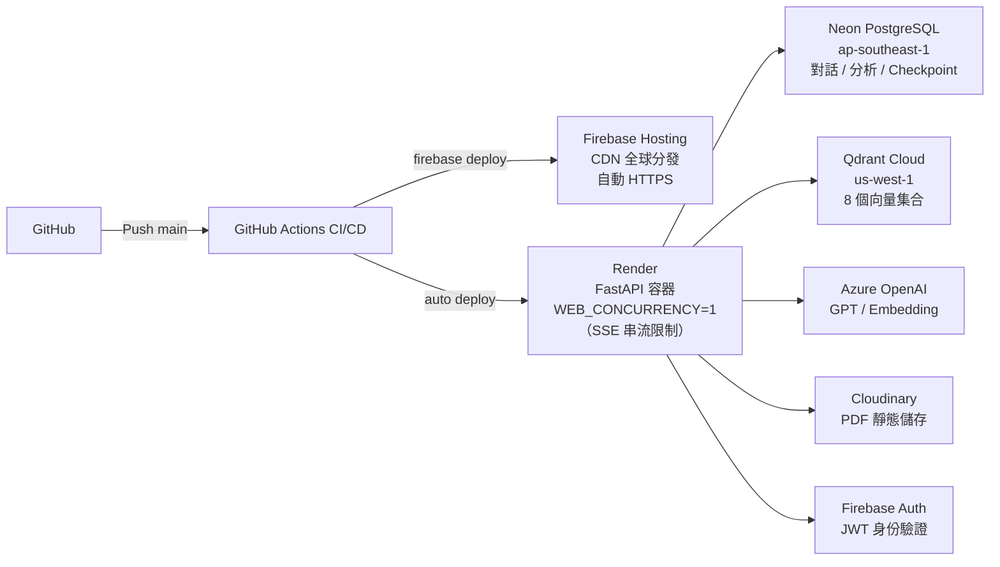

# 人工智慧跨域應用專題 — 簡報腳本

> 建議工具：Marp / reveal.js / Gamma  
> 預計時長：15–20 分鐘（不含 Demo）  
> 頁數：18 頁  
> `---` = 換頁

---

---

# Slide 1｜封面

```
國立中央大學
人工智慧跨域應用專題

AI 選課助理暨大專研究計畫平台
NCU Course Assistant & Research Exploration Platform

報告日期：2026-06-XX
指導教授：XXX 教授
組員：XXX、XXX、XXX
```

> **設計提示**：深色背景（navy），白字，右下角放 NCU Logo

---

---

# Slide 2｜我們在解決什麼問題？

**高中生幾乎沒有直接的管道了解大學真正在做什麼。**

課程資訊分散在各處  ·  研究世界遙不可及  ·  科系介紹只停留在表面

**我們打造了一個 AI 平台來改變這件事。**

  →  用自然語言詢問任何 NCU 課程
  →  依系所瀏覽真實的大專研究計畫
  →  完成 AI 生成的興趣量表，獲得科系推薦
  →  透過使用紀錄，發現自己的學習傾向如何演變

*互動式  ·  對話式  ·  不需要任何背景知識*

---

---

# Slide 3｜系統兩條主線

```
┌──────────────────────────────────────────────────────────┐
│                  共用基礎設施                              │
│     Azure OpenAI · Qdrant · PostgreSQL · Firebase Auth    │
├──────────────────────────┬───────────────────────────────┤
│   課程智能助理            │   PDF 研究計畫系統             │
│                          │                               │
│  LLM + 知識圖譜 +        │  RAG 問答 + AI 摘要 +         │
│  向量搜尋                │  興趣量表                     │
│                          │                               │
│  目標：高中生看懂大學課程  │  目標：高中生探索科系興趣       │
└──────────────────────────┴───────────────────────────────┘
         +
┌────────────────┐  ┌──────────────────────────────────┐
│ 個人學習傾向   │  │  系統監控儀表板（開發者用）         │
│ /profile       │  │  /monitor                        │
└────────────────┘  └──────────────────────────────────┘
```

---

---

# Slide 4｜整合資料規模

**我們整合了什麼資料？**

| 資料類型 | 來源 | 規模 |
|---------|------|------|
| 大學部課程 | NCU 課務系統 | **3,594 門** |
| 研究所課程 | NCU 課務系統 | **930 門** |
| 教師領域專長 | 教育部一覽表 | **1,009 位**，2,469 個專長詞彙 |
| 應修科目表 | NCU 教務處 | **28 系所**，458 門必修課 |
| 學分學程 | NCU 課務資訊網 | **42 個學程**，998 門課 |
| 科系介紹 | Collego | **~40 個系所** |
| 大專研究計畫 PDF | 國科會 | **459 份**（104–114 學年） |
| 修課資格規則 | 課務系統解析 | **7,282 條** |

→ 全部整合後：知識圖譜 **15,186 節點 / 37,055 邊**

> **備稿**：這些資料分散在各個網站、PDF、CSV，都需要客製化的 scraper 和解析器。

---

---

# Slide 5｜雲端部署架構



**為何 Render 設 1 Worker？**
SSE 長連線佔用 thread，多 worker 會讓串流中斷 → 單容器確保串流安全。

---

---

# Slide 6｜技術選型重點

**後端關鍵選擇**

| 選擇 | 技術 | 原因 |
|------|------|------|
| LLM | Azure OpenAI（多模型）gpt-5.4-mini · gpt-4o · gpt-4o-mini | 依功能選用，台灣合規 |
| 向量搜尋 | Qdrant Hybrid（Dense + BM25） | 語意 + 關鍵字雙路搜尋 |
| 圖資料庫 | igraph in-memory | PPR 0.23s/次，無外部依賴 |
| Agent 框架 | LangGraph | 狀態機管理多步驟研究 |
| Reranking | FlashrankRerank（本地） | 無額外 API 費用 |
| 串流 | SSE（Server-Sent Events） | 逐字輸出 LLM 回應 |

**Embedding 策略**

```
text-embedding-3-large（3072 維）dense vector
+ FastEmbedSparse BM25 sparse vector
→ Hybrid 融合：語意理解 × 關鍵字精確度
```

---

---

# Slide 7｜資料與知識基礎

```
原始資料（課程 / 教師 / 系所 / 學程 / 通識）
    │
    ↓  清洗 + NLP 萃取（Qwen3-14B 本地離線）
    ↓  Embedding（Dense 3072維 + BM25 Sparse）
    │
    ├─────────────────────┬──────────────────────────┐
    │                     │                          │
    ▼                     ▼                          ▼
Qdrant 向量索引      知識圖譜                   PostgreSQL
6 個 Collection      15,186 節點 / 37,055 邊    對話記錄 / 分析
語意搜尋基礎         課程 ↔ 概念 ↔ 教師 ↔ 學程
```

> **備稿**：NLP 萃取本地跑批次，節省 API 費用。概念節點 7,286 個是圖譜最大類，讓搜尋能理解同義詞。

---

---

# Slide 8｜課程智能助理

GPT-4o 接收自然語言提問，並行呼叫 14 個工具，透過 SSE 串流逐字輸出回答與課程卡片。

```
┌──────────────────────────────┬──────────────────────────────┐
│  ReAct Agent                 │  六路 RRF 搜尋融合            │
│  GPT-4o + 14 工具            │  語意 · 精確 · 圖捷徑 …      │
│  自然語言提問                │  多路命中，最佳結果自動排頂   │
│  即時獲得課程規劃建議        │                              │
├──────────────────────────────┼──────────────────────────────┤
│  知識圖譜 PPR 探索           │  課程卡片精準保障            │
│  種子概念 →                  │  標籤萃取 +                  │
│  在圖上擴散，找出            │  fuzzy match 確保            │
│  關聯課程 / 教師 / 系所      │  每次輸出資訊正確            │
└──────────────────────────────┴──────────────────────────────┘
```

---

---

# Slide 9｜核心功能二：大專研究計畫系統

459 份大專研究計畫 PDF（104–114 學年）

```
┌─────────────────────┬─────────────────────────┬─────────────────────┐
│  計畫瀏覽            │  興趣量表                │  PDF 問答           │
│                     │                          │                     │
│  依系所或學年瀏覽    │  AI 閱讀每份 PDF，生成   │  針對計畫內容提問   │
│  計畫清單，透過      │  結構化題目。高中生答題  │  — 研究背景、方法、 │
│  Cloudinary CDN      │  → 系統評分 → 推薦最符   │  成果皆可詢問，     │
│  直接串流原始 PDF。  │  合的前 15 個科系。      │  由多 Agent RAG 回答│
└─────────────────────┴─────────────────────────┴─────────────────────┘
```

儲存：Cloudinary（PDF 原檔）· Qdrant 14,819 個 chunk · PostgreSQL（AI 摘要與評分）

---

---

# Slide 10｜PDF 攝入 — 多解析器策略

學術 PDF 格式差異大，單一解析器品質不穩。三層解析器依品質自動升級：

```
pymupdf4llm  →  Azure Document Intelligence  →  LlamaParse
（本地/最快）    （複雜版面 / 含公式）           （最高品質備援）

→ 語意切 chunk · 自動排除封面、目錄、參考文獻 · Qdrant 14,819 筆向量
```

---

---

# Slide 11｜興趣量表 — 三步驟 AI Pipeline

```
Step 1   Research Agent — RAG 取證
         針對每份 PDF 取證，涵蓋四個面向：
         研究動機 · 研究方法 · 研究成果 · 研究限制

              │
              ├──────────────────────────┐
              ▼                          ▼

Step 2（並行）                 Step 3（並行）
結構化萃取                     題目生成
─────────────────────          ──────────────────────
研究動機  ≤200 字              導讀文      100–220 字
研究方法  ≤200 字              三道問題    各 45–80 字
研究成果  ≤200 字
標籤 × 3–5

              └──────────────────────────┘
                           ↓
              預存資料庫 · 即時供應

三種年級模式：高一（廣泛）· 高二（文理篩選）· 高三（依學測科目）
```

---

---

# Slide 12｜PDF 問答 — 多 Agent 架構

Router 升級為 **LLM-based、context-aware** 分流——讀取文件摘要與對話狀態，不再只靠問題關鍵字判斷。

```
┌──────────────────────────────────────────────────────────┐
│  Router  (LLM-based)                                     │
│  讀取：文件摘要 + 對話歷史                                 │
└───────────────────────────┬──────────────────────────────┘
                            │ 路由至對應層級
                            ▼
┌──────────────────────────────────────────────────────────┐
│  Tier 1  Chat Agent                                      │
│          AgentStatus ✓  ──────────────────────► 回答     │
│          AgentStatus ✗  ──────────────────── escalate ↓  │
├──────────────────────────────────────────────────────────┤
│  Tier 2  Retrieval Agent（單次 RAG）                      │
│          AgentStatus ✓  ──────────────────────► 回答     │
│          AgentStatus ✗  ──────────────────── escalate ↓  │
├──────────────────────────────────────────────────────────┤
│  Tier 3  Research Agent（LangGraph）                      │
│          ① 規劃覆蓋目標                                   │
│          ② HyDE 搜尋 → 取回 chunk                        │
│             ↑                  ↓                         │
│             └──── 不足 ───── 評估覆蓋率                   │
│          AgentStatus ✓  ──────────────────────► 最終回答  │
└──────────────────────────────────────────────────────────┘
```

---

---

# Slide 13｜PDF 問答 — 設計決策

**AgentStatus** — 每個 Agent 回答後自我評估信心，Router 依此決定是否升級，避免不必要的昂貴呼叫。

**HyDE** — 先讓 LLM 假設答案樣貌再搜尋，比直接搜尋原始問題召回率更高。

**Model fallback** — 主要 Azure OpenAI 無回應時自動降級為 mini model，確保服務不中斷。

---

---

# Slide 14｜個人學習傾向分析（/profile）

> 期末新增功能 — Demo 時將展示 UI，此頁說明後端邏輯

**資料來源**：從使用者**對話歷史**自動萃取，不需填問卷

```
課程助理對話記錄          PDF 問答記錄
（chat_turns）            （pdf_agent_messages）
       │                         │
       ▼                         ▼
/api/chat/analytics         /api/chat/pdf-analytics
       │                         │
       └──────────┬──────────────┘
                  ↓
        PostgreSQL user_analytics 表
        15 分鐘快取自動更新
                  ↓
        前端：雷達圖 / 詞雲 / 圓餅圖 / 診斷型態
```

**六軸雷達**：理工 / 資訊 / 地科 / 生醫 / 人文 / 商管（課程與研究計畫使用相同座標系）

**探索型態診斷**：課程助理 5 型、研究計畫 5 型、綜合 6 型，依使用行為自動歸類

---

---

# Slide 15｜系統監控儀表板（/monitor）

一個儀表板——即時掌握系統健康、各功能費用與使用行為，無需登入任何外部平台。

**5 個 Tab**

```
總覽          兩功能合計費用 + 活躍用戶 + 課程 vs PDF 對比
課程推薦      gpt-5.4-mini 延遲 · Token 趨勢 · 14 工具使用統計
大專生計畫    gpt-4o agent + gpt-4o-mini router · Agent 路由分佈
資料庫        PostgreSQL · Qdrant 集合狀態 · Cloudinary 儲存
對話活動      使用趨勢 · 尖峰時段 · 對話深度分析
```

**三種模型分開計費**

```
用途              模型             每百萬 Token（Input / Output）
──────────────    ─────────────    ──────────────────────────────
課程推薦          gpt-5.4-mini     $0.75  /  $4.50
PDF 深度研究      gpt-4o           $2.50  / $10.00
PDF 路由判斷      gpt-4o-mini      $0.15  /  $0.60
```

> PDF 費用追蹤：Python `contextvars` 在單次請求內累積 Router + Agent 所有 token，是準確計算每輪費用的唯一方式。

---

---

# Slide 16｜期中 → 期末的演進

**期中已完成**

- 課程智能助理（ReAct + 14 工具 + 知識圖譜）
- PDF 問答系統（多 Agent + LangGraph）
- 興趣量表（AI Pipeline + 前端評測）
- 雲端部署（Firebase + Render + Neon + Qdrant Cloud）

**期末新增 / 強化**

| 項目 | 說明 |
|------|------|
| 個人學習傾向分析 | `/profile`：對話歷史自動萃取，雷達圖 / 詞雲 / 診斷型態 |
| 系統監控儀表板 | `/monitor`：5 Tab，三種 Model 費用拆分，端到端 Latency |
| PDF 問答升級 | LLM-based router、AgentStatus 自評信心、Model fallback |
| 六路 RRF 搜尋 | Signal A/B/excl/N/N2/C 融合，exact_match 置頂 |
| 課程助理強化 | get_course_detail 三合一、課程卡片萃取流水線、Token/Latency 追蹤 |

---

---

# Slide 17｜LIVE DEMO

```
┌─────────────────────────────────────────┐
│                                         │
│           LIVE DEMO                     │
│                                         │
│   1. 課程智能助理對話                    │
│      → 搜尋課程、查詢先修、PPR 探索     │
│                                         │
│   2. PDF 研究計畫問答                   │
│      → 上傳 / 選取計畫、深度研究問答    │
│                                         │
│   3. 興趣量表                           │
│      → 選年級 → 答題 → 推薦科系         │
│                                         │
│   4. 個人學習傾向分析                   │
│      → 雷達圖 / 探索型態診斷            │
│                                         │
│   5. 系統監控儀表板（選）               │
│      → Token 費用 / Latency 統計        │
│                                         │
└─────────────────────────────────────────┘
```

---

---

# Slide 18｜總結 & Q&A

**我們做了什麼**

- 整合 **8 個資料來源**、建構 15,186 節點知識圖譜
- 實作 **兩套 RAG 系統**：課程 ReAct（14 工具）× PDF 多 Agent（LangGraph）
- 六路 RRF 搜尋融合 + PPR 圖探索
- 三步驟 AI Pipeline 自動生成興趣量表題目
- 全端雲端部署（Firebase + Render + Neon + Qdrant + Azure）

**技術亮點**

1. **igraph in-memory PPR**：0.23s 完成全圖 Personalized PageRank
2. **contextvars Token 收集**：跨多次 LLM 呼叫正確累積 PDF 費用
3. **多解析器自動升級**：依 PDF 品質自動選用最佳解析策略
4. **AgentStatus 路由**：Agent 回答後自我評估信心，Router 依此決定是否升級，不盲目往上送
5. **Model fallback middleware**：主要 Azure OpenAI 無回應時自動切換 mini model，零人工介入

---

**Q & A**

---

---

## 附錄：報告時間分配建議

| 段落 | 頁數 | 建議時間 |
|------|------|---------|
| 封面 + 問題定位 + 使用情境 + 主線 | 1–4 | 3 分鐘 |
| 資料規模 + 系統架構 + 部署 | 5–7 | 3 分鐘 |
| 技術選型 + 資料基礎 + 課程助理 | 8–10 | 3 分鐘 |
| 課程助理 + PDF 系統（5 頁） | 8–13 | 4 分鐘 |
| Profile + Monitor | 14–15 | 2 分鐘 |
| 演進 + Demo 過渡 | 16–17 | 1 分鐘 |
| **Demo** | — | **5–8 分鐘** |
| 總結 + Q&A | 18 | 1 分鐘 |
| **合計** | | **~16–21 分鐘** |
